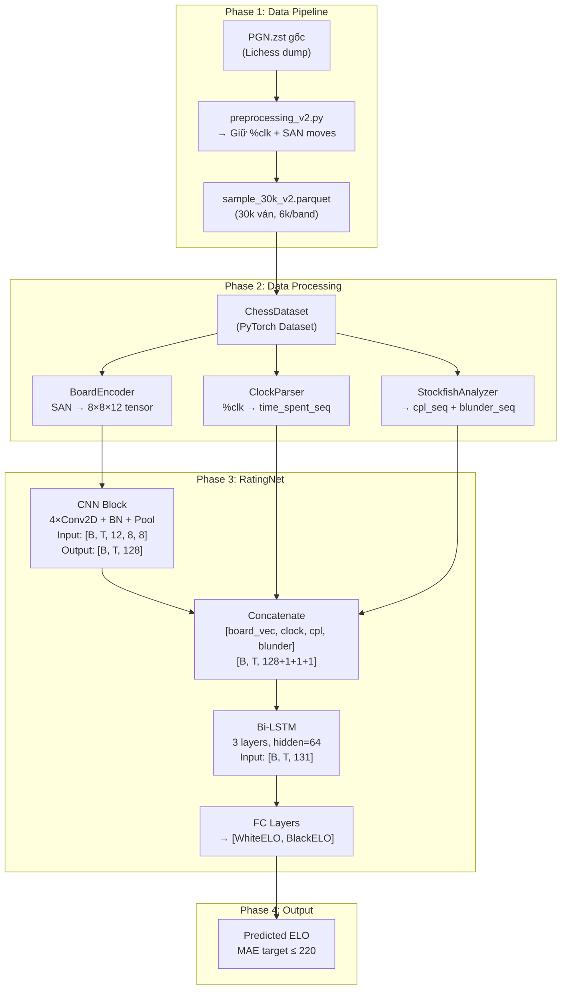

# DL Rating Net — Thiết kế hệ thống

## Architecture Overview

## Data Models

### Input Tensor Format (per game, per time-step)

| Feature | Shape | Mô tả |
|---|---|---|
| Board State | `[12, 8, 8]` | 12 mặt phẳng (6 quân × 2 màu) |
| Clock Time | `[1]` | Thời gian còn lại (chuẩn hóa) |
| CPL | `[1]` | Centipawn loss của nước đi (Stockfish) |
| Blunder Flag | `[1]` | 1 nếu CPL > 200, 0 nếu không |

### Batch Tensor (sau padding)

| Tensor | Shape | Ghi chú |
|---|---|---|
| `positions` | `[B, T, 12, 8, 8]` | B=batch, T=max_moves (pad) |
| `clocks` | `[B, T]` | Chuẩn hóa (mean/std) |
| `cpls` | `[B, T]` | CPL per move |
| `blunders` | `[B, T]` | Binary flag |
| `targets` | `[B, 2]` | [WhiteELO, BlackELO] chuẩn hóa |
| `lengths` | `[B]` | Độ dài thực tế (cho pack_padded) |

## Component Breakdown

### 1. `src/data/create_30k_sample_v2.py` (Track A — Làm ngay)
- Đọc 2 file parquet lớn (2×23GB, ~187M ván)
- Reservoir sampling 6k/band, **KHÔNG filter** thể thức và time forfeit
- Giữ cột `Moves` (SAN) + các metadata (EloAvg, TimeControl, Result...)
- ⚠ **KHÔNG có clock time** (parquet đã bị strip `%clk`)
- Output: `sample_30k_v2.parquet`

### 1b. `src/data/extract_with_clocks.py` (Track B — Sau khi download PGN.zst)
- Stream PGN.zst → reservoir sampling 30k ván (6k/band)
- Parse `%clk` từ PGN comment (`node.comment`) thay vì `variation_san()`
- Giữ cả SAN moves + clock sequence
- Dừng sớm khi đủ 30k (chỉ cần đọc ~1% file)
- Output: `sample_30k_with_clocks.parquet`

### 2. `src/data/board_encoder.py`
- Hàm `encode_board(board: chess.Board) → np.ndarray[12, 8, 8]`
- Mỗi mặt phẳng = 1 loại quân (P, N, B, R, Q, K) × 2 màu (W, B)
- Giá trị: 1.0 nếu có quân tại ô đó, 0.0 nếu không

### 3. `src/data/chess_dataset.py`
- PyTorch Dataset: load parquet → replay ván cờ → encode board states
- Trả về dict: `{positions, clocks, cpls, blunders, targets, length}`
- Hỗ trợ `max_moves` truncation

### 4. `src/models/rating_net.py`
- Port từ `paperbaseline.py` class `ChessEloPredictor`
- Sửa `input_size` của LSTM: `conv_filters*8 + 1 + 1 + 1` (thêm cpl + blunder)
- Giữ nguyên CNN block 4 tầng, Bi-LSTM 3 layers

### 5. `src/models/train.py`
- Training loop: Adam optimizer, L1Loss (MAE)
- ReduceLROnPlateau scheduler
- Checkpoint saving
- TensorBoard logging

## Design Decisions

### DD-1: Giữ cấu trúc CNN giống paper gốc
- **Lý do:** Đảm bảo so sánh công bằng (apple-to-apple).
- **Trade-off:** CNN 4 tầng có thể chưa tối ưu, nhưng là điểm xuất phát hợp lý.

### DD-2: Thêm CPL + Blunder vào concat layer (không thay thế CNN)
- **Lý do:** CPL là thông tin bổ sung (Stockfish đánh giá), không phải thay thế Board State.
- **Cách ghép:** Nối vào cùng lúc với clock ở bước concat trước LSTM.

### DD-3: Không filter thể thức và time forfeit
- **Lý do:** Giữ nguyên như paper để so sánh. Time management là tín hiệu quan trọng.

### DD-4: max_moves = 150 (có thể điều chỉnh)
- **Lý do:** P95 = 134 plies. 150 bao phủ ~96% ván mà không quá lãng phí memory.

## Non-Functional Requirements

| Yêu cầu | Mục tiêu |
|---|---|
| Training time (30k, GPU) | ≤ 2 giờ |
| GPU VRAM | ≤ 8GB (batch_size=32) |
| Data processing (30k) | ≤ 1 giờ (Stockfish CPL extraction) |
| Reproducibility | Seed 42, deterministic DataLoader |
