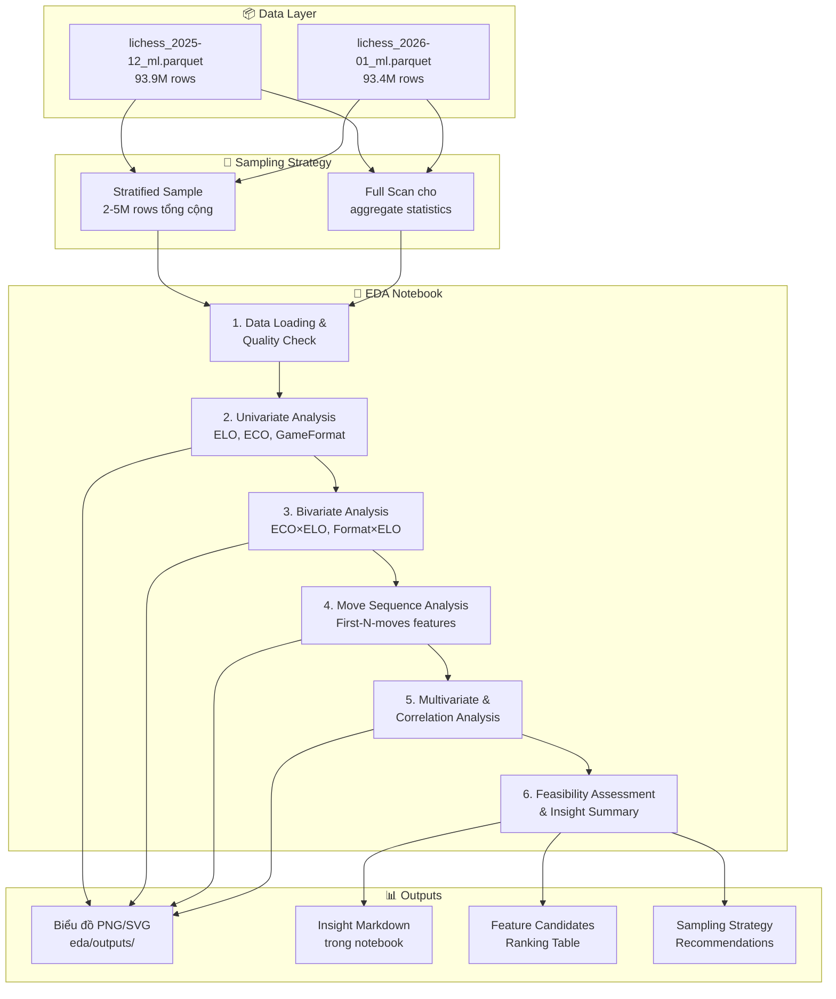
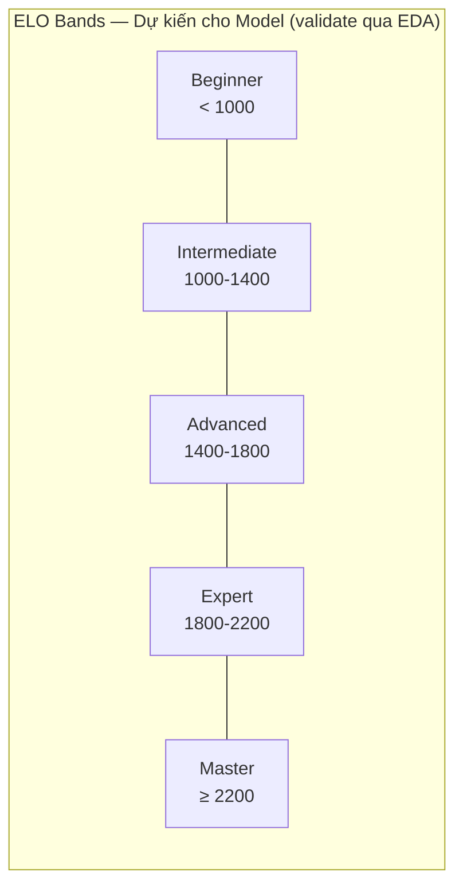

# System Design & Architecture — EDA cho Dự đoán ELO Realtime

## Architecture Overview
**Kiến trúc tổng thể của pha EDA**



### Công nghệ sử dụng
| Thành phần      | Công cụ           | Lý do chọn                                          |
|-----------------|-------------------|------------------------------------------------------|
| Data Loading    | Polars LazyFrame   | Zero-copy, lazy eval, xử lý 90M+ rows không OOM     |
| Data Wrangling  | Polars expressions | Nhanh hơn pandas 5-10×, native Parquet support       |
| Visualization   | Matplotlib + Seaborn | Chuẩn academic, export PNG/SVG dễ dàng            |
| Notebook        | Jupyter (.ipynb)   | Kết hợp code + markdown insight + biểu đồ inline    |
| Move Parsing    | python-chess       | Parse SAN moves, extract first-N-moves features      |
| Feature Importance | XGBoost (GPU)  | Tận dụng RTX 3060 12GB cho tree-based feature ranking nhanh |
| GPU Compute     | CUDA 12.x + RTX 3060 | 12 GB VRAM — đủ cho XGBoost GPU, embedding experiments |

## Data Models
**Cấu trúc dữ liệu trong EDA**

### Bảng gốc (Parquet Schema — 14 cột)
```
Result (cat) | WhiteElo (i16) | BlackElo (i16) | EloAvg (i16) | NumMoves (i16)
WhiteRatingDiff (i16) | BlackRatingDiff (i16) | ECO (cat) | Termination (cat)
Moves (str) | ResultNumeric (f32) | BaseTime (i16) | Increment (i16) | GameFormat (cat)
```

### Derived Features cho EDA (tính trong notebook)
```python
# Từ WhiteElo/BlackElo
EloDiff       = WhiteElo - BlackElo       # Int16  — chênh lệch ELO
EloMax        = max(WhiteElo, BlackElo)    # Int16  — ELO cao nhất trong ván
EloMin        = min(WhiteElo, BlackElo)    # Int16  — ELO thấp nhất
EloBand       = bin(EloAvg, [0,800,1000,1200,1400,1600,1800,2000,2200,2500,3500])
                                            # Categorical — nhóm ELO

# Từ Moves (chuỗi SAN)
FirstNMoves   = extract_first_n(Moves, n)  # String — N nước đi đầu tiên
OpeningDepth  = count_book_moves(Moves)    # Int    — độ sâu opening book match
MoveEntropy   = shanon_entropy(FirstNMoves) # Float  — complexity/randomness

# Từ ECO
EcoCategory   = ECO[0]                     # A/B/C/D/E — nhóm khai cuộc chính
EcoSubgroup   = ECO[:2]                    # A0-E9  — nhóm khai cuộc phụ
```

### ELO Band Design (quan trọng cho classification)

#### Fine-grained Bins (dùng cho EDA — 10 bins)
```python
ELO_BINS = [0, 800, 1000, 1200, 1400, 1600, 1800, 2000, 2200, 2500, 3500]
ELO_LABELS = ['<800', '800-1000', '1000-1200', '1200-1400', '1400-1600',
              '1600-1800', '1800-2000', '2000-2200', '2200-2500', '2500+']
```

#### Coarse-grained Bands (dùng cho ML classification — 5 bands)


> **Chiến lược 2 tầng**: EDA dùng 10 bins fine-grained để thấy rõ phân phối. Khi training model, sẽ group lại thành 5 bands coarse-grained để đủ samples mỗi class. Số bands thực tế sẽ được quyết định SAU EDA dựa trên phân phối thực.

## Cấu trúc phân tích EDA (EDA Analysis Blueprint)

### Module 1: Data Quality & Overview
- Load data bằng Polars LazyFrame (scan_parquet)
- Kiểm tra null/missing values mỗi cột
- Thống kê mô tả (describe) cho numeric columns
- Value counts cho categorical columns
- **Output**: Summary table, data quality report

### Module 2: Univariate Analysis — Phân phối ELO
- Histogram + KDE cho WhiteElo, BlackElo, EloAvg
- Box plot phát hiện outliers
- Phân phối theo GameFormat (Bullet vs Blitz vs Rapid)
- **Kiểm tra**: Phân phối chuẩn? Bimodal? Skewed?
- **Output**: 2-3 biểu đồ, nhận xét phân phối

### Module 3: Univariate Analysis — Opening & Game Patterns
- Top 20 ECO codes phổ biến nhất (bar chart)
- Phân phối NumMoves (histogram)
- Phân phối GameFormat (pie/bar chart)
- Phân phối Termination types
- **Output**: 2-3 biểu đồ

### Module 4: Bivariate Analysis — ECO × ELO (CORE)
- **Heatmap**: ECO category (A-E) × ELO band → tỷ lệ chọn (%)
- **Stacked bar**: Top 10 ECO codes ở ELO < 1200 vs > 2000
- **Box plot**: EloAvg distribution cho top 10 ECO codes
- **Mục đích**: Validate giả thuyết "opening choice ≈ ELO proxy"
- **Output**: 3-4 biểu đồ + nhận xét

### Module 5: Bivariate Analysis — EloDiff × Result
- Scatter/heatmap: EloDiff vs Win Rate
- Line plot: Win rate theo EloDiff bins
- **Mục đích**: Baseline hiểu biết — ELO diff predict result tốt thế nào?
- **Output**: 1-2 biểu đồ

### Module 6: Move Sequence Analysis (CRITICAL for Model Design)
- Trích xuất first-5, first-10, first-15 moves
- **N-gram analysis**: Bigram/trigram phổ biến nhất theo ELO band
- **Opening diversity**: Số ECO codes unique theo ELO band (higher ELO = wider repertoire?)
- **First move distribution**: e4 vs d4 vs c4 vs Nf3 theo ELO band
- **Mục đích**: Đánh giá "sau bao nhiêu nước đi, ta có đủ signal?"
- **Output**: 2-3 biểu đồ + quantitative assessment

### Module 7: Multivariate Correlation & Feature Importance
- Correlation matrix (heatmap) cho numeric features
- Mutual Information giữa categorical features và EloAvg
- Feature importance ranking dùng **XGBoost GPU** (RTX 3060) trên sample 1-3M rows — nhanh hơn nhiều so với CPU DecisionTree, cho phép sample lớn hơn và feature space rộng hơn
- Optional: thử move embedding (hash-based) + GPU-accelerated feature importance
- **Output**: 1-2 biểu đồ + feature ranking table

### Module 8: Class Imbalance & Sampling Strategy
- Bar chart: Số lượng ván mỗi ELO band
- Imbalance ratio calculation
- Đề xuất: Stratified sampling? SMOTE? Class weights?
- So sánh phân phối Dec 2025 vs Jan 2026 (temporal stability)
- **Output**: 1-2 biểu đồ + đề xuất cụ thể

### Module 9: Feasibility Assessment & Actionable Insights
- Tổng hợp findings từ Module 1-8
- Trả lời 3 câu hỏi chiến lược (Q1-Q3 từ requirements)
- Feature candidate ranking table
- Đề xuất modeling approach
- Next steps cho Feature Engineering

## Design Decisions
**Tại sao chọn cách tiếp cận này?**

### Decision 1: Sampling thay vì Full Dataset cho EDA
- **Chọn**: Stratified sample 2-5M rows + lazy aggregation cho full dataset
- **Lý do**: 187M rows quá lớn cho visualization. Sample đủ đại diện cho EDA. Full scan chỉ khi cần aggregate stats.
- **Trade-off**: Có thể miss rare patterns ở ELO cực cao/thấp → dùng oversampling ở tails

### Decision 2: Polars thay vì Pandas
- **Chọn**: Polars LazyFrame
- **Lý do**: Native Parquet reader, lazy evaluation, 5-10× nhanh hơn Pandas cho large datasets
- **Alternative**: Pandas + PyArrow — chậm hơn, tốn RAM hơn, nhưng ecosystem lớn hơn

### Decision 3: ELO Bands 5 classes thay vì regression
- **Chọn**: Classification (5 ELO bands) thay vì regression (predict exact ELO)
- **Lý do cho EDA**: Dễ visualize, dễ đánh giá class imbalance, dễ so sánh distributions. Model thực tế có thể dùng regression, nhưng EDA theo bands cho insight rõ hơn.

### Decision 4: Focus Opening phase (first 5-15 moves)
- **Chọn**: Phân tích sâu opening phase thay vì full game
- **Lý do**: Mục tiêu cuối là predict ELO từ **vài nước đi đầu** → EDA phải validate tín hiệu ở giai đoạn này
- **Tham khảo**: Maia Chess (Microsoft Research) chứng minh move patterns strongly ELO-dependent

### Decision 5: Không dùng Stockfish trong EDA
- **Chọn**: Không evaluate positions bằng engine
- **Lý do**: Quá tốn compute cho 187M ván. Sẽ xem xét ở Feature Engineering cho sample nhỏ hơn.
- **Alternative tương lai**: Centipawn loss analysis trên sample 100K ván

### Decision 6: GPU cho Feature Importance (XGBoost) thay vì chỉ CPU
- **Chọn**: XGBoost với `device='cuda'` trên RTX 3060 12GB
- **Lý do**: Cho phép train trên sample lớn hơn (1-3M rows) trong thời gian ngắn (<2 phút). DecisionTree CPU chỉ xử lý tốt ~200K rows.
- **Trade-off**: Cần cài thêm xgboost GPU build. Nếu fail, fallback về DecisionTree CPU.
- **Bonus**: Mở đường cho GPU-accelerated model training ở Giai đoạn 3

## API Design
**Giao tiếp giữa các thành phần**

> N/A — Đây là EDA notebook, không có API endpoints. Kết quả giao tiếp qua biểu đồ và markdown insights trong notebook.

## Component Breakdown
**Các building blocks chính**

Xem chi tiết tại section "Cấu trúc phân tích EDA" ở trên — 9 modules phân tích từ Data Quality đến Feasibility Assessment.

## Non-Functional Requirements
**Yêu cầu phi chức năng**

- **Performance**: Notebook chạy end-to-end < 10 phút trên máy dev (CPU 20 threads + GPU RTX 3060)
- **Memory**: Peak RAM usage < 20 GB, peak VRAM usage < 10 GB
- **Reproducibility**: Random seed cố định, sampling reproducible
- **Visual Quality**: Biểu đồ đạt chuẩn academic paper (DPI ≥ 150, font size hợp lý, colorblind-friendly palette)
- **Maintainability**: Code modular, functions tách riêng, dễ re-run với data khác
