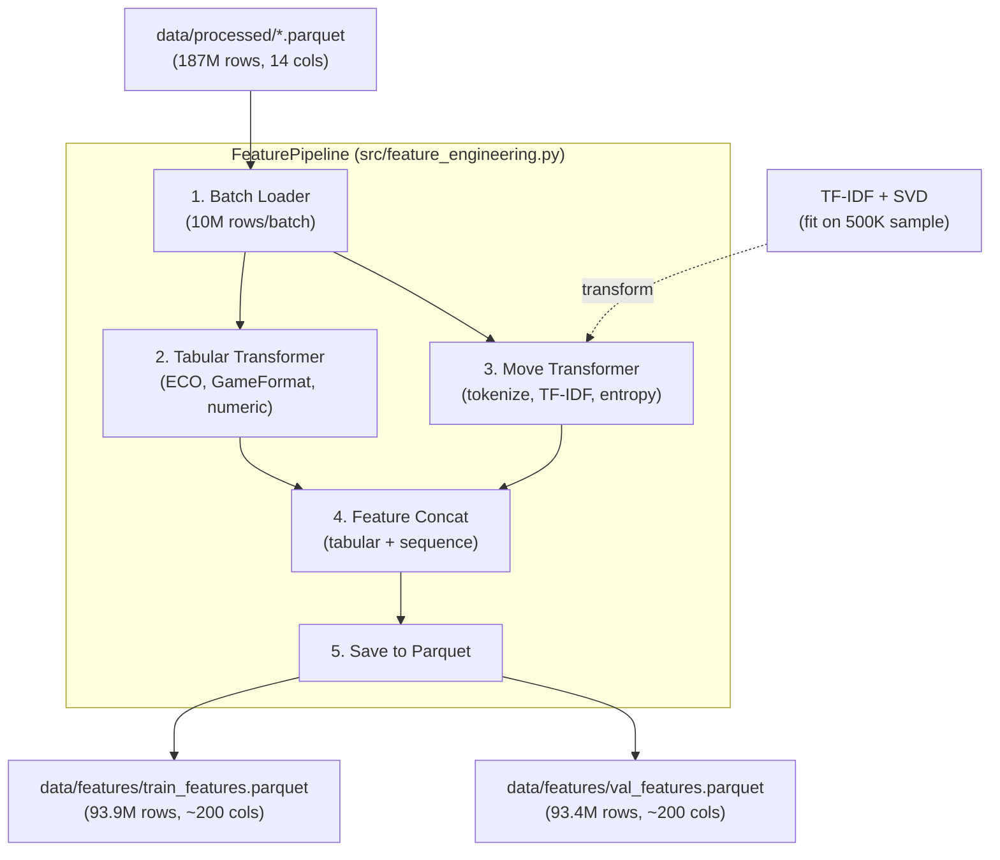

# Design — Feature Engineering cho Dự đoán ELO Realtime

## Architecture Overview



## Components

### 1. BatchLoader

```python
class BatchLoader:
    """Load từ Parquet theo batch để tránh OOM."""
    def iter_batches(self, files, batch_size=10_000_000):
        # Dùng Polars offset/length hoặc scan với chunked collect
```

### 2. TabularTransformer

```python
class TabularTransformer:
    """Encode các cột tabular thành numeric features."""

    def fit(self, df: pl.DataFrame) -> None:
        # Fit ECO vocabulary (top-N ECO codes)
        # Fit GameFormat vocabulary

    def transform(self, df: pl.DataFrame) -> pl.DataFrame:
        # ECO one-hot (top 100)
        # EcoCategory one-hot (A-E)
        # GameFormat one-hot
        # BaseTime log1p
        # Increment log1p
        # NumMoves clip(0, 100) / 100
        # EloDiff: chỉ include nếu realtime=False
```

**Output columns** (~115 cols):

- `eco_A`, `eco_B`, `eco_C`, `eco_D`, `eco_E` (5 cols)
- `eco_A00`, `eco_A01`, ..., `eco_E99` — top 100 (100 cols)
- `gf_Bullet`, `gf_Blitz`, `gf_Rapid`, `gf_Classical`, `gf_UltraBullet` (5 cols)
- `basetime_log`, `increment_log` (2 cols)
- `num_moves_norm` (1 col)
- `first_move_e4`, ..., `first_move_other` (5 cols)

### 3. MoveTransformer

```python
class MoveTransformer:
    """Encode move sequences thành numeric features."""

    def fit(self, moves_series: pl.Series, sample_size=500_000) -> None:
        # Tokenize + fit TF-IDF + fit SVD

    def transform(self, moves_series: pl.Series) -> np.ndarray:
        # Tokenize → TF-IDF → SVD 50d → return array

    def _tokenize(self, moves_san: str, n_ply: int = 10) -> list[str]:
        # Strip move numbers, game results
        # Return first n_ply tokens

    def _entropy(self, tokens: list[str]) -> float:
        # Shannon entropy của unigram distribution
```

**Output columns** (~56 cols):

- `svd_0` ... `svd_49` (50 cols) — LSA from TF-IDF bigrams
- `move_entropy` (1 col)
- `has_castles_ks`, `has_castles_qs` (2 cols) — kingside/queenside castling in first 20 ply
- `check_count_15ply` (1 col)
- `pawn_push_ratio` (1 col) — số pawn moves / total moves in first 10 ply
- `first_move_e4`, `first_move_d4`, `first_move_Nf3`, `first_move_c4`, `first_move_other` (overlap với Tabular, keep here)

**Tổng cộng**: ~171 input features

### 4. Target Encoder

```python
TARGET_COLUMN = "ModelBand"
TARGET_MAP = {
    "Beginner": 0,      # EloAvg 0-1000
    "Intermediate": 1,  # EloAvg 1000-1400
    "Advanced": 2,      # EloAvg 1400-1800
    "Expert": 3,        # EloAvg 1800-2200
    "Master": 4,        # EloAvg 2200+
}
```

## Data Split Strategy

```
lichess_2025-12_ml.parquet → TRAIN (93.9M rows)
lichess_2026-01_ml.parquet → VALIDATION (93.4M rows)
```

**Lý do**: Temporal split phản ánh realistic deployment — train trên historical, evaluate trên future games. Tránh tương quan trong cùng thời gian (same players play in both files).

## Feature Store Schema

```
data/features/train_features.parquet
├── ModelBand: Int8                    # Target: 0-4
├── eco_A ... eco_E: Float32 (5)      # EcoCategory
├── eco_A00 ... (top-100): Float32    # ECO one-hot
├── gf_Bullet ... (5): Float32        # GameFormat
├── basetime_log: Float32
├── increment_log: Float32
├── num_moves_norm: Float32
├── first_move_e4 ... (5): Float32
├── svd_0 ... svd_49: Float32 (50)    # LSA features
├── move_entropy: Float32
├── has_castles_ks: Float32
├── has_castles_qs: Float32
├── check_count_15ply: Float32
└── pawn_push_ratio: Float32
```

## Data Models & Relationships

### Input Data Model

- Nguồn: `data/processed/*.parquet`
- Thực thể chính mỗi bản ghi: một ván cờ đã chuẩn hóa
- Cột đầu vào chính: `Moves`, `ECO`, `GameFormat`, `BaseTime`, `Increment`, `NumMoves`, `ModelBand`

### Output Data Model

- Nguồn đích: `data/features/train_features.parquet`, `data/features/val_features.parquet`
- Quan hệ: 1 bản ghi input -> 1 bản ghi output feature (trừ các bản ghi bị loại do `<5 ply`)
- Ràng buộc:
  - `ModelBand` là target dạng Int8 trong khoảng [0, 4]
  - Các cột feature là Float32
  - Schema output phải nhất quán giữa train/val

### Artifact Model

- `tfidf_vocabulary.pkl`: ánh xạ n-gram -> chỉ số cột
- `svd_components.pkl`: ma trận giảm chiều cho move TF-IDF
- `feature_columns.json`: danh sách cột cuối cùng theo thứ tự cố định

## API/Interface Contracts

### Pipeline Input Contract

- Input files phải theo schema đã chuẩn hóa từ giai đoạn preprocessing
- `Moves` phải là chuỗi SAN hợp lệ hoặc rỗng/null có thể xử lý được
- Split contract:
  - `lichess_2025-12_ml.parquet` -> train
  - `lichess_2026-01_ml.parquet` -> validation

### Pipeline Output Contract

- Bắt buộc sinh ra:
  - `data/features/train_features.parquet`
  - `data/features/val_features.parquet`
  - metadata artifacts (`tfidf_vocabulary.pkl`, `svd_components.pkl`, `feature_columns.json`)
- Data quality contract:
  - Drop records `<5 ply`
  - Pass nếu drop rate <=1.5% trên từng split; fail nếu >3%

### Auth/Security Contract

- Không có auth contract ở mức API vì đây là pipeline nội bộ chạy offline trên filesystem

## Design Decisions

### Decision 1: Temporal vs Random Split

- **Chọn**: Temporal (Dec 2025 train, Jan 2026 val)
- **Lý do**: Tránh data leakage từ cùng player trong dataset. Phản ánh production scenario tốt hơn.

### Decision 2: TF-IDF bigrams thay vì token embedding

- **Chọn**: TF-IDF on move bigrams → SVD 50d
- **Lý do**: Không cần GPU để tính. Có thể scale đến millions of games. Embedding sẽ dùng trong LSTM phase.

### Decision 3: Float32 thay vì Float64

- **Chọn**: Float32 cho tất cả features
- **Lý do**: 50% memory savings. XGBoost GPU natively dùng float32. Precision đủ cho tabular features.

### Decision 4: Top-100 ECO thay vì all 500

- **Chọn**: Top 100 ECO codes (one-hot 100d)
- **Lý do**: Top 100 ECO codes cover ~95% games. Remaining codes có too few samples → noisy features.

### Decision 5: EloDiff excluded from realtime features

- **Chọn**: EloDiff (WhiteElo - BlackElo) KHÔNG include trong feature vector
- **Lý do**: EloDiff sử dụng ELO values → data leakage! Chỉ useful cho offline analysis.
  - **Exception**: Nếu chỉ train/eval offline (không realtime), có thể include để measure upper bound.

### Decision 6: Missing-moves policy (<5 ply)

- **Chọn**: Loại bỏ bản ghi có số ply < 5 trong quá trình feature extraction
- **Lý do**: Các ván quá ngắn thường thiếu tín hiệu opening đủ ổn định cho phân lớp ELO
- **Ngưỡng chất lượng**:
  - Pass: tỉ lệ bản ghi bị loại <= 1.5% trên từng split
  - Warning: (1.5%, 3%] cần báo cáo phân bố theo `GameFormat` và `ModelBand`
  - Fail: > 3% không đạt tiêu chí nghiệm thu

### Decision 7: Optimization priority khi chưa đạt acc mục tiêu

- **Chọn**: move n-gram/sequence -> ECO encoding -> game metadata
- **Lý do**: Move sequence chứa tín hiệu kỹ năng mạnh nhất, ECO là proxy opening, metadata chủ yếu bổ trợ

## Non-functional Requirements

- **Memory**: Batch size 10M rows × 14 cols (Int16/Categorical) ≈ 2.8 GB → ok với 24GB available RAM
- **Storage**: 93.9M rows × 171 cols × 4 bytes (Float32) ≈ 64 GB → dùng Parquet compression (zstd) → ~15-20 GB mỗi file
- **Time (SLA)**: Pipeline full dữ liệu phải hoàn thành trong **< 4 giờ**
- **Time (estimate hiện tại)**: 187M rows / 10M per batch = 19 batches. Ước tính 10-15 phút/batch → khoảng ~3-5 giờ; cần tối ưu I/O và transform để đạt SLA

> **Alternative nếu storage quá lớn**: Chỉ save sample 10M rows để prototype, full 187M để production training.
