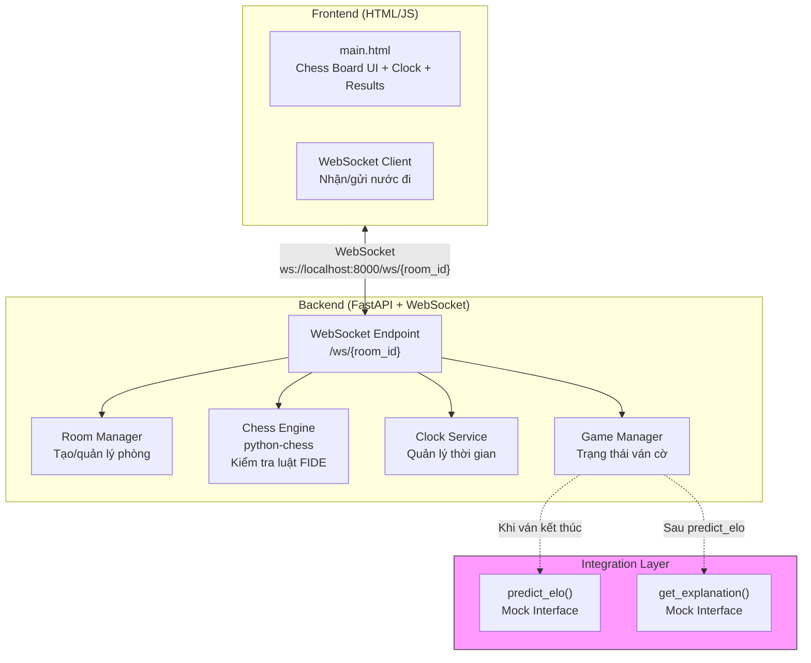
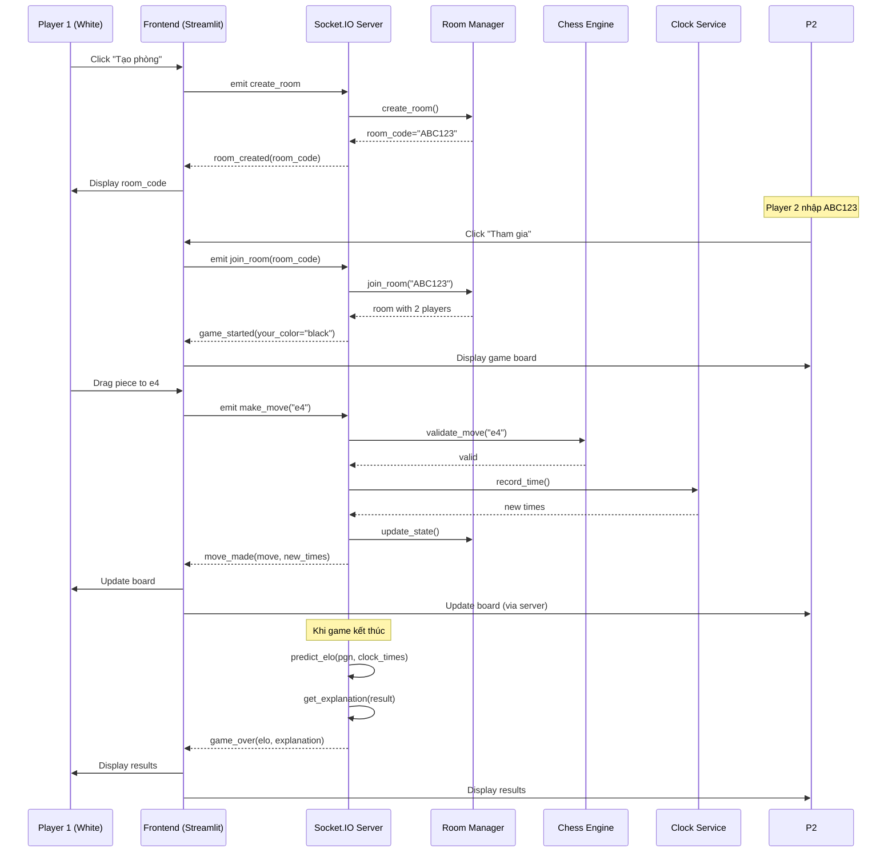

# Design: Game Server Chess Multiplayer

## Architecture Overview



### Components và trách nhiệm

| Component | Trách nhiệm | File |
|-----------|-------------|------|
| `HTML Frontend` | Giao diện chính, chess board (chessboard.js), clock display | `src/game_server/main.py` |
| `WebSocket Server` | Quản lý kết nối WebSocket, broadcast messages | `src/game_server/main.py` |
| `Room Manager` | Tạo/xóa phòng, track players trong phòng | `src/game_server/rooms.py` |
| `Chess Engine` | Kiểm tra luật cờ, sinh PGN, phát hiện game end | `src/game_server/chess_engine.py` |
| `Clock Service` | Đếm ngược, ghi nhận thời gian suy nghĩ | `src/game_server/clock.py` |
| `Game Manager` | Điều phối trạng thái game, gọi integration | `src/game_server/game.py` |
| `predict_elo()` | Mock interface cho AI Model | `src/game_server/integration.py` |
| `get_explanation()` | Mock interface cho XAI Engine | `src/game_server/integration.py` |

### Technology Stack

| Layer | Công nghệ | Phiên bản | Lý do |
|-------|-----------|-----------|-------|
| **Backend** | FastAPI | >= 0.109 | FastAPI cho REST + WebSocket native |
| **Frontend** | HTML + JS (chessboard.js, chess.js) | - | Serve trực tiếp từ server |
| **Chess Logic** | python-chess | >= 1.9 | Chuẩn FIDE, PGN parsing, move validation |
| **WebSocket** | FastAPI WebSocket | - | Native support, không cần thư viện bổ sung |

---

## Data Models

### 1. Room Entity

```python
from pydantic import BaseModel, Field
from enum import Enum
from typing import Optional
from datetime import datetime

class RoomStatus(str, Enum):
    WAITING = "waiting"      # Chờ đối thủ
    PLAYING = "playing"      # Đang chơi
    FINISHED = "finished"    # Đã kết thúc

class PlayerColor(str, Enum):
    WHITE = "white"
    BLACK = "black"

class Room(BaseModel):
    room_code: str = Field(pattern=r"^[A-Z0-9]{6}$")  # VD: "ABC123"
    status: RoomStatus
    white_player: Optional[str] = None  # Socket ID
    black_player: Optional[str] = None
    created_at: datetime
    fen: str = "rnbqkbnr/pppppppp/8/8/8/8/PPPPPPPP/RNBQKBNR w KQkq - 0 1"
    moves: list[str] = []           # SAN notation
    clock_white: float = 900.0      # 15 phút = 900 giây
    clock_black: float = 900.0
    clock_times: list[float] = []   # Thời gian suy nghĩ mỗi nước (giây)
    time_control: str = "15+0"       # 15 phút, không increment
    current_turn: PlayerColor = PlayerColor.WHITE
    game_result: Optional[str] = None  # "white", "black", "draw"
```

### 2. Time Control Options

| Format | Minutes | Increment | Total Time |
|--------|---------|-----------|------------|
| 15+0 | 15 | 0s | 15 phút |
| 10+0 | 10 | 0s | 10 phút |
| 5+3 | 5 | 3s | 5 phút + 3s/nước |
| 3+0 | 3 | 0s | 3 phút |

### 3. Socket.IO Events

```python
# Client → Server Events

# Tạo phòng mới
{
    "event": "create_room",
    "data": {
        "time_control": "15+0"  # Optional, default "15+0"
    }
}

# Tham gia phòng
{
    "event": "join_room",
    "data": {
        "room_code": "ABC123"
    }
}

# Di chuyển quân
{
    "event": "make_move",
    "data": {
        "move": "e4"  # SAN notation
    }
}

# Xin thua
{
    "event": "resign",
    "data": {}
}

# Server → Client Events

# Phòng được tạo
{
    "event": "room_created",
    "data": {
        "room_code": "ABC123"
    }
}

# Người chơi tham gia
{
    "event": "player_joined",
    "data": {
        "color": "white"  # hoặc "black"
    }
}

# Game bắt đầu
{
    "event": "game_started",
    "data": {
        "your_color": "white",
        "fen": "rnbqkbnr/pppppppp/8/8/8/8/PPPPPPPP/RNBQKBNR w KQkq - 0 1",
        "clock_white": 900.0,
        "clock_black": 900.0,
        "time_control": "15+0"
    }
}

# Nước đi được thực hiện
{
    "event": "move_made",
    "data": {
        "move": "e4",
        "san": "1. e4 ...",
        "fen": "rnbqkbnr/pppppppp/8/8/4P3/8/PPPP1PPP/RNBQKBNR b KQkq e3 0 1",
        "clock_white": 895.2,
        "clock_black": 900.0,
        "is_check": true,
        "is_checkmate": false
    }
}

# Game kết thúc
{
    "event": "game_over",
    "data": {
        "result": "white",  # "white", "black", "draw"
        "reason": "checkmate",  # "checkmate", "stalemate", "timeout", "resignation"
        "pgn": "1. e4 e5 2. Nf3 Nc6 3. Bc4 ... *",
        "clock_times": [5.2, 3.1, 12.0, ...],
        "white_elo": 1523,
        "black_elo": 1345,
        "stats": {
            "white_avg_cpl": 45.2,
            "black_avg_cpl": 67.8,
            "white_blunders": 2,
            "black_blunders": 4
        },
        "explanation": "Trắng được dự đoán ELO ~1523..."
    }
}

# Lỗi
{
    "event": "error",
    "data": {
        "code": "ROOM_FULL",
        "message": "Phòng đã đầy"
    }
}
```

### 4. Integration Interface (Contracts)

```python
# src/game_server/integration.py
# ĐÂY LÀ CONTRACT - Thành viên 1 viết placeholder,
# Thành viên 2 & 3 sẽ thay thế implementation

def predict_elo(pgn_string: str, clock_times: list[float]) -> dict:
    """
    Dự đoán ELO từ ván cờ.

    Args:
        pgn_string: Chuỗi PGN chuẩn (ví dụ: "1. e4 e5 2. Nf3 Nc6")
        clock_times: Danh sách thời gian suy nghĩ (giây), xen kẽ Trắng-Đen

    Returns:
        dict với cấu trúc:
        {
            "white_elo": int,      # ELO dự đoán cho Trắng
            "black_elo": int,      # ELO dự đoán cho Đen
            "stats": {
                "white_avg_cpl": float,
                "black_avg_cpl": float,
                "white_blunders": int,
                "black_blunders": int,
            }
        }
    """
    # MOCK - Thành viên 2 sẽ thay thế
    import random
    return {
        "white_elo": random.randint(1200, 2000),
        "black_elo": random.randint(1200, 2000),
        "stats": {
            "white_avg_cpl": round(random.uniform(20, 100), 1),
            "black_avg_cpl": round(random.uniform(20, 100), 1),
            "white_blunders": random.randint(0, 5),
            "black_blunders": random.randint(0, 5),
        }
    }


def get_explanation(prediction_result: dict) -> str:
    """
    Sinh lời giải thích cho kết quả dự đoán ELO.

    Args:
        prediction_result: Output từ predict_elo()

    Returns:
        str: Lời giải thích bằng ngôn ngữ tự nhiên
    """
    # MOCK - Thành viên 3 sẽ thay thế
    return (
        f"Trắng được dự đoán ELO ~{prediction_result['white_elo']} dựa trên "
        f"chất lượng nước đi (CPL trung bình: {prediction_result['stats']['white_avg_cpl']}). "
        f"Đen được dự đoán ELO ~{prediction_result['black_elo']}."
    )
```

---

## API Design

### Socket.IO Events

#### Room Management

| Event | Direction | Payload | Description |
|-------|-----------|---------|-------------|
| `create_room` | Client → Server | `{time_control?: string}` | Tạo phòng mới |
| `room_created` | Server → Client | `{room_code: string}` | Trả về mã phòng |
| `join_room` | Client → Server | `{room_code: string}` | Tham gia phòng |
| `player_joined` | Server → Client | `{color: string}` | Thông báo có người tham gia |
| `error` | Server → Client | `{code: string, message: string}` | Lỗi (ROOM_NOT_FOUND, ROOM_FULL, INVALID_MOVE) |

#### Game Events

| Event | Direction | Payload | Description |
|-------|-----------|---------|-------------|
| `game_started` | Server → Client | `{your_color, fen, clock_white, clock_black, time_control}` | Game bắt đầu |
| `make_move` | Client → Server | `{move: string}` | Thực hiện nước đi (SAN) |
| `move_made` | Server → Client | `{move, san, fen, clock_white, clock_black, is_check, is_checkmate}` | Nước đi được thực hiện |
| `resign` | Client → Server | `{}` | Xin thua |
| `game_over` | Server → Client | `{result, reason, pgn, clock_times, white_elo, black_elo, stats, explanation}` | Game kết thúc |

### REST Endpoints (Health)

| Method | Path | Mô tả | Response |
|--------|------|--------|----------|
| GET | `/` | Root info | `{"message": "MMD-G2 Game Server", "version": "1.0.0"}` |
| GET | `/health` | Health check | `{"status": "ok"}` |

### Data Flow



---

## Component Breakdown

### 1. Backend Components

#### WebSocket Server + HTML Frontend (`src/game_server/main.py`)
Server FastAPI với WebSocket endpoint tích hợp HTML/JS frontend (chessboard.js + chess.js).

#### Room Manager (`src/game_server/rooms.py`)
- Quản lý dict of rooms: `{room_code: Room}`
- Methods:
  - `create_room(time_control) -> room_code` (6 ký tự alphanumeric)
  - `get_room(room_code) -> Room`
  - `join_room(room_code, sid) -> {success, color, game_started, error}`
  - `delete_room(room_code)`

#### Chess Engine (`src/game_server/chess_engine.py`)
- Wrapper around python-chess
- Methods:
  - `validate_move(fen, move_san) -> bool`
  - `make_move(fen, move_san) -> {new_fen, is_check, is_checkmate}`
  - `get_game_status(fen) -> {is_over, result, reason}`
  - `to_pgn(moves) -> pgn_string`

#### Clock Service (`src/game_server/clock.py`)
- Quản lý đồng hồ cho mỗi phòng
- Methods:
  - `parse_time_control(tc) -> (seconds, increment)`
  - `start(room_id)`
  - `record_time(color) -> elapsed`
  - `get_remaining(room_id) -> {white, black}`
  - `get_clock_times() -> list[float]`

#### Game Manager (`src/game_server/game.py`)
- Điều phối toàn bộ game logic
- Methods:
  - `handle_move(room_id, move_san, sid) -> {success, error}`
  - `check_game_over(room_id) -> {is_over, result, reason}`
  - `end_game(room_id, reason) -> game_result`
  - `resign(room_id, sid) -> {success, result}`

### 2. Frontend Components

Frontend được serve trực tiếp từ `src/game_server/main.py` dưới dạng HTML/JS (chessboard.js + chess.js). Không cần Streamlit hay separate frontend folder.

- Lobby: Tạo phòng / nhập mã phòng
- Game: Bàn cờ chessboard.js, đồng hồ, danh sách nước đi
- Result: Overlay hiển thị ELO, stats, explanation

---

## Design Decisions

### Decision 1: FastAPI native WebSocket thay vì Socket.IO
- **Chọn:** FastAPI WebSocket native (đã thay đổi từ Socket.IO)
- **Lý do:** Không cần thư viện bổ sung, đơn giản hơn, HTML/JS frontend tự nhiên hơn
- **Lý do:**
  - Streamlit có tích hợp Socket.IO sẵn có (`st.socketio`)
  - Fallback to long-polling nếu WebSocket fail
  - Auto-reconnection built-in
  - Đã được user xác nhận muốn dùng Socket.IO

### Decision 2: Streamlit cho Frontend
- **Chọn:** Streamlit
- **Lý do:**
  - Python-only, không cần JavaScript
  - Rapid prototyping, có thể thay đổi nhanh
  - Tích hợp Socket.IO tốt
  - Team đã quen Python

### Decision 3: python-chess cho Chess Logic
- **Chọn:** python-chess
- **Lý do:**
  - Chuẩn FIDE, đầy đủ luật
  - PGN parsing/saving
  - Move validation
  - Không cần tự implement

### Decision 4: Mock Interface cho AI/XAI
- **Chọn:** Placeholder functions trong `src/game_server/integration.py`
- **Lý do:**
  - Theo đúng nguyên tắc từ v5-poc-architecture.md
  - Cho phép phát triển song song
  - Interface là contract giữa các module

### Decision 5: In-memory Storage (không Database)
- **Chọn:** Dict/Map in-memory
- **Lý do:**
  - Không cần persistence
  - Đơn giản, không cần setup database
  - Dữ liệu mất khi restart server (chấp nhận được)

### Decision 6: Room Code là 6 ký tự alphanumeric
- **Chọn:** Format `ABC123`
- **Lý do:**
  - Dễ đọc và nhập
  - 36^6 = 2 tỷ combinations, đủ cho local demo
  - Không cần collision check trong MVP

---

## Non-Functional Requirements

### Performance
- Socket.IO latency: < 100ms (local network)
- Chess move validation: < 10ms
- Game start time: < 2s sau khi người thứ 2 join
- Clock accuracy: ±0.1s

### Scalability
- Hỗ trợ 10-20 concurrent rooms
- Mỗi room tối đa 2 players
- Stateless server (ngoại trừ in-memory rooms)

### Security (Local Demo)
- Không có authentication
- CORS cho phép localhost
- Không có input sanitization nâng cao

### Usability
- Giao diện đơn giản, dễ hiểu
- Clear error messages
- Loading states khi chờ

### Browser Support
- Chrome 90+
- Firefox 88+
- Safari 14+
- Edge 90+

---

## Error Codes

| Code | Message | Trường hợp |
|------|---------|------------|
| `ROOM_NOT_FOUND` | Phòng không tồn tại | Nhập mã phòng sai |
| `ROOM_FULL` | Phòng đã đầy | Cố gắng join phòng đã có 2 người |
| `ROOM_PLAYING` | Ván đấu đang diễn ra | Cố gắng join phòng đang chơi |
| `INVALID_MOVE` | Nước đi không hợp lệ | Di chuyển sai luật |
| `NOT_YOUR_TURN` | Chưa đến lượt bạn | Cố gắng đi khi chưa đến lượt |
| `INVALID_TIME_CONTROL` | Thể thức thời gian không hợp lệ | Chọn time control không đúng format |
