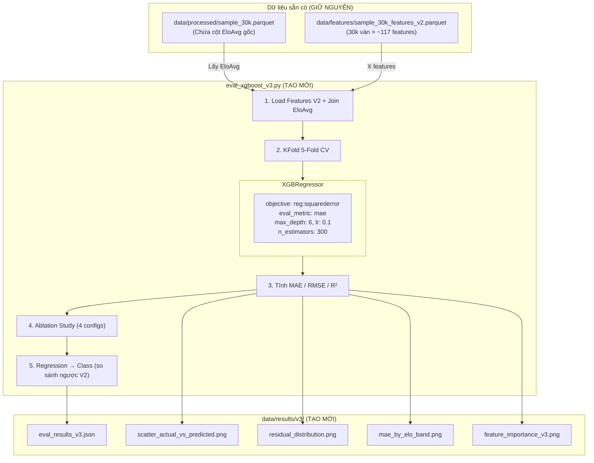

# Design V3 — Regression ELO Prediction

## Architecture Overview



## Components

### 1. Dữ liệu (GIỮ NGUYÊN — chỉ thêm bước Join)

| Nguồn | Vai trò |
|--------|---------|
| `data/features/sample_30k_features_v2.parquet` | X features (~117 cột: 106 tabular + 11 engine) |
| `data/processed/sample_30k.parquet` | Lấy cột `EloAvg` làm target y |

**Bước Join:**
```python
# Load features V2
features_df = pd.read_parquet("data/features/sample_30k_features_v2.parquet")

# Load raw data để lấy EloAvg
raw_df = pd.read_parquet("data/processed/sample_30k.parquet")

# Join target
y = raw_df["EloAvg"].values  # Float, range 400-3700+
X = features_df.drop(columns=["ModelBand"])  # Bỏ cột classification target
```

### 2. Model: XGBRegressor (THAY THẾ XGBClassifier)

| Parameter | Giá trị | Lý do |
|-----------|---------|-------|
| `objective` | `reg:squarederror` | MSE loss, chuẩn cho regression |
| `eval_metric` | `mae` | Metric trực quan nhất cho bài toán ELO |
| `max_depth` | 6 | Giữ nguyên từ V2, đã chứng minh không overfit |
| `learning_rate` | 0.1 | Giữ nguyên từ V2 |
| `n_estimators` | 300 | Tăng từ 200 (V2) vì regression thường cần nhiều trees hơn |
| `random_state` | 42 | Reproducibility |
| `n_jobs` | -1 | Dùng hết cores |

### 3. Cross-Validation Strategy

| Thuộc tính | V2 (Classification) | V3 (Regression) |
|------------|---------------------|-----------------|
| **CV Type** | StratifiedKFold | **KFold** (không cần stratify cho target liên tục) |
| **n_splits** | 5 | 5 |
| **Shuffle** | True | True |
| **random_state** | 42 | 42 |

### 4. Metrics

| Metric | Công thức | Ý nghĩa |
|--------|----------|---------|
| **MAE** | mean(\|y_pred - y_true\|) | "Trung bình mỗi ván, model đoán lệch bao nhiêu ELO?" |
| **RMSE** | sqrt(mean((y_pred - y_true)²)) | Phạt nặng hơn các ván dự đoán lệch cực lớn |
| **R²** | 1 - SS_res / SS_tot | Tỷ lệ phương sai được giải thích (1.0 = hoàn hảo) |
| **Classification Accuracy** | Chuyển y_pred → Band → so sánh | Đối chiếu trực tiếp với V2 (47.59%) |

### 5. Ablation Study (4 Configs)

Tái sử dụng cấu trúc V2 để so sánh:

| Config | Features sử dụng | Kỳ vọng MAE |
|--------|-------------------|-------------|
| **A** | Tabular Only (ECO + NumMoves) | ~320 ELO |
| **B** | Tabular + Nhóm A (avg_cpl, blunder_rate,...) | ~250 ELO |
| **C** | Tabular + A + B (+ phase CPL) | ~230 ELO |
| **D** | Full V2 (A + B + C) | **~200 ELO** |

### 6. Trực quan hóa (4 biểu đồ)

| Biểu đồ | Mô tả | File output |
|----------|--------|-------------|
| **Scatter Plot** | Actual vs Predicted ELO + đường y=x | `scatter_actual_vs_predicted.png` |
| **Residual Distribution** | Histogram (Predicted - Actual) | `residual_distribution.png` |
| **MAE by ELO Band** | Bar chart MAE trung bình theo 5 dải | `mae_by_elo_band.png` |
| **Feature Importance** | Top 20 features quan trọng nhất | `feature_importance_v3.png` |

### 7. So sánh ngược Classification

```python
# Bins ranh giới class (giống V2)
ELO_BINS = [0, 1000, 1400, 1800, 2200, 9999]
BAND_LABELS = [0, 1, 2, 3, 4]  # Beginner → Master

# Chuyển ELO dự đoán → Band
predicted_bands = pd.cut(y_pred, bins=ELO_BINS, labels=BAND_LABELS)
actual_bands = pd.cut(y_true, bins=ELO_BINS, labels=BAND_LABELS)

# Tính accuracy
regression_as_class_accuracy = (predicted_bands == actual_bands).mean()
```

## Design Decisions

### Decision 1: Dùng KFold thay StratifiedKFold
- **Chọn**: `KFold(n_splits=5, shuffle=True)`
- **Lý do**: Target là giá trị liên tục (EloAvg), không thể stratify trực tiếp. Có thể dùng binned stratification nhưng thêm phức tạp mà không đáng.

### Decision 2: Tăng n_estimators từ 200 → 300
- **Chọn**: 300 trees thay vì 200
- **Lý do**: Regression thường cần nhiều cây hơn classification để hội tụ, đặc biệt khi target range rộng (400 → 3700+).

### Decision 3: Dùng MSE thay Huber Loss
- **Chọn**: `reg:squarederror` (MSE)
- **Lý do**: Bước đầu dùng MSE cho đơn giản. Nếu scatter plot cho thấy nhiều outliers nghiêm trọng → chuyển sang Huber ở iteration sau.

### Decision 4: Không normalize target EloAvg
- **Chọn**: Giữ EloAvg raw (400-3700+)
- **Lý do**: XGBoost là tree-based model, không bị ảnh hưởng bởi scale. MAE/RMSE trên raw ELO dễ diễn giải hơn.

### Decision 5: Chỉ tạo 1 file code mới
- **Chọn**: Tạo riêng `eval_xgboost_v3.py`, không sửa V2
- **Lý do**: Giữ V2 nguyên vẹn để so sánh. V3 là file standalone, self-contained.

## Non-Functional Requirements

### Performance
- Training 5-Fold CV trên 30k ván: **< 5 phút** (XGBoost regression nhanh hơn classification)
- Tổng thời gian chạy `eval_xgboost_v3.py` (bao gồm plots): **< 10 phút**

### Reproducibility
- `random_state=42` cho cả KFold và XGBRegressor
- Lưu đầy đủ metrics vào `eval_results_v3.json`
