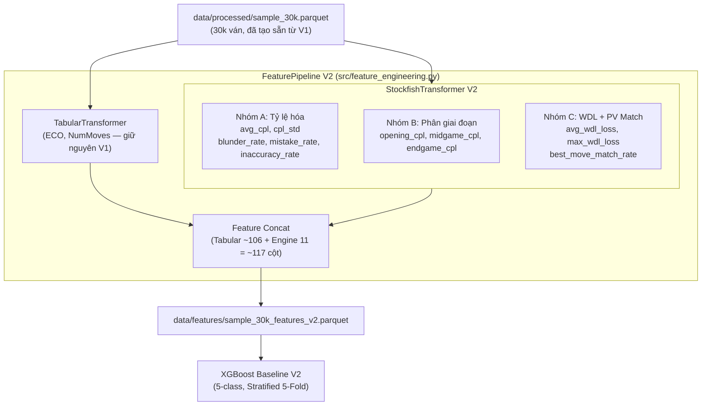

# Design V2 — Nâng cấp Stockfish Feature Engineering

## Architecture Overview



## Components

### 1. Dữ liệu đầu vào (Giữ nguyên từ V1)
- Sử dụng lại `data/processed/sample_30k.parquet` (30.000 ván, 6.000/band)
- Không cần tạo lại sample mới

### 2. TabularTransformer (Giữ nguyên từ V1)
- ECO one-hot (top 100) + EcoCategory (A-E) + NumMoves_norm
- **KHÔNG** thêm lại GameFormat/BaseTime/Increment

### 3. StockfishTransformer V2 — Nâng cấp lõi

#### Nhóm A: Chỉ số Toàn ván (Tỷ lệ hóa)
Thay đếm thô bằng tỷ lệ % để loại bỏ bias do độ dài ván cờ.

| Feature | Công thức | Kiểu | Mô tả |
|---------|----------|------|-------|
| `avg_cpl` | mean(CPL) | Float32 | CPL trung bình toàn ván (giữ nguyên) |
| `cpl_std` | std(CPL) | Float32 | Độ dao động CPL (giữ nguyên) |
| `blunder_rate` | count(CPL>300) / total_moves | Float32 | **Tỷ lệ** Blunders (thay blunder_count) |
| `mistake_rate` | count(100<CPL≤300) / total_moves | Float32 | **Tỷ lệ** Mistakes (thay mistake_count) |
| `inaccuracy_rate` | count(50<CPL≤100) / total_moves | Float32 | **Tỷ lệ** Inaccuracies (thay inaccuracy_count) |

#### Nhóm B: Chỉ số Phân giai đoạn (ĐỘT PHÁ 1)

| Feature | Phạm vi | Kiểu | Mô tả |
|---------|---------|------|-------|
| `opening_cpl` | Nước 1-10 (Ply 1-20) | Float32 | CPL trung bình khai cuộc |
| `midgame_cpl` | Nước 11-30 (Ply 21-60) | Float32 | CPL trung bình trung cuộc (NaN nếu ván <11 nước) |
| `endgame_cpl` | Nước 31+ (Ply 61+) | Float32 | CPL trung bình tàn cuộc (NaN nếu ván <31 nước) |

> **Lưu ý thiết kế**: Giữ nguyên NaN cho ván ngắn. XGBoost/LightGBM xử lý NaN natively và coi đó là tín hiệu (ván bị tiêu diệt sớm = dấu hiệu ELO thấp).

#### Nhóm C: Chỉ số WDL & PV Match (ĐỘT PHÁ 2)

| Feature | Công thức | Kiểu | Mô tả |
|---------|----------|------|-------|
| `avg_wdl_loss` | mean(win_before - win_after) / 1000 | Float32 | Trung bình mất xác suất thắng (normalize [0,1]) |
| `max_wdl_loss` | max(win_before - win_after) / 1000 | Float32 | Pha ném đi nhiều % thắng nhất |
| `best_move_match_rate` | count(move == PV[0]) / total_moves | Float32 | Tỷ lệ đi trùng nước tối ưu Stockfish |

**Cách lấy WDL từ Stockfish:**
```python
info = engine.analyse(board, limit, info=chess.engine.INFO_ALL)
wdl = info["score"].pov(turn).wdl()
# wdl.wins, wdl.draws, wdl.losses (tổng = 1000)
win_prob = wdl.wins / 1000.0  # normalize [0, 1]
```

**Cách lấy Best Move (PV[0]):**
```python
info = engine.analyse(board, limit)
best_move = info["pv"][0]  # Nước tối ưu theo engine
actual_move = board.parse_san(san)
is_match = (best_move == actual_move)
```

### 4. Cột bị loại bỏ (Anti-Leakage)

| Cột | Lý do loại |
|-----|-----------|
| `WhiteElo`, `BlackElo`, `EloAvg` | Target trực tiếp |
| `WhiteRatingDiff`, `BlackRatingDiff` | Post-game leakage |
| `Result`, `ResultNumeric` | Thắng/thua ván đơn không phản ánh trình độ |
| `BaseTime`, `Increment`, `GameFormat` | Gây bias thể thức thay vì đo chiến thuật |
| `Termination` | Tương quan cao với GameFormat |

### 5. Feature Store Schema V2

```
data/features/sample_30k_features_v2.parquet
├── ModelBand: Int8                         # Target: 0-4
├── eco_A ... eco_E: Float32 (5)           # EcoCategory
├── eco_XXX (top-100): Float32             # ECO one-hot
├── num_moves_norm: Float32
│
├── avg_cpl: Float32                       # Nhóm A
├── cpl_std: Float32
├── blunder_rate: Float32                  # V2: rate thay count
├── mistake_rate: Float32
├── inaccuracy_rate: Float32
│
├── opening_cpl: Float32                   # Nhóm B (MỚI)
├── midgame_cpl: Float32
├── endgame_cpl: Float32
│
├── avg_wdl_loss: Float32                  # Nhóm C (MỚI)
├── max_wdl_loss: Float32
└── best_move_match_rate: Float32          # Nhóm C (MỚI)
```

**Tổng cộng**: ~117 features (106 tabular + 11 engine)

## Design Decisions

### Decision 1: Tỷ lệ hóa thay đếm thô
- **Chọn**: `blunder_rate = count / total_moves` thay vì `blunder_count`
- **Lý do**: Ván 80 nước sẽ có nhiều blunder hơn ván 20 nước đơn giản vì dài hơn. Tỷ lệ hóa loại bỏ bias này.

### Decision 2: Phân giai đoạn cứng (10/30 nước)
- **Chọn**: Opening = nước 1-10, Midgame = nước 11-30, Endgame = nước 31+
- **Lý do**: Ranh giới cứng đơn giản hóa implementation. Trong thực tế, giai đoạn ván cờ phụ thuộc vào số quân trên bàn, nhưng phân chia theo nước đi là xấp xỉ hợp lý và nhanh hơn nhiều so với đếm quân.

### Decision 3: WDL normalize về [0, 1]
- **Chọn**: `win_prob = wdl.wins / 1000.0`
- **Lý do**: Stockfish trả về WDL tổng 1000 (e.g., 600/300/100). Normalize về [0, 1] để đồng nhất scale với các features khác.

### Decision 4: Giữ nguyên depth=10
- **Chọn**: Không tăng depth mặc dù V2 cần thêm thông tin WDL
- **Lý do**: WDL được tính từ NNUE evaluation, không phụ thuộc nhiều vào depth. Depth 10 đủ để WDL có ý nghĩa. Tăng depth sẽ làm chậm pipeline đáng kể.

### Decision 5: Stockfish NNUE bắt buộc
- **Chọn**: Yêu cầu Stockfish 16+ với NNUE enabled
- **Lý do**: WDL probability chỉ có khi dùng NNUE evaluation. Stockfish 18 đã build sẵn tại `.tmp/stockfish_binary` có NNUE mặc định.
