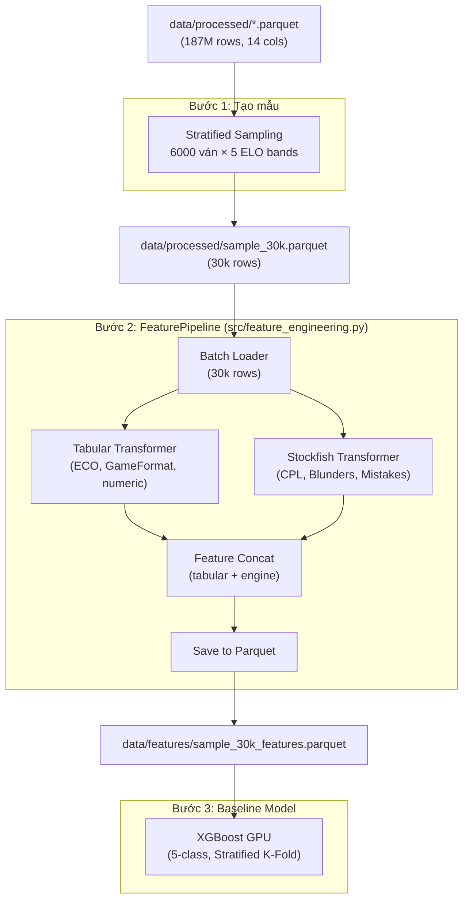

# Design — Stockfish CPL Feature Engineering

## Architecture Overview



## Components

### 1. Sampling Script (`src/create_30k_sample.py`)
- Đọc Parquet gốc bằng Polars LazyFrame
- Tính `ModelBand` từ `EloAvg` theo bins [0, 1000, 1400, 1800, 2200, +∞)
- Random sample 6000 ván/band (seed=42)
- Shuffle và lưu `data/processed/sample_30k.parquet`

### 2. TabularTransformer (Đã tinh gọn)
- ECO one-hot (top 100)
- EcoCategory one-hot (A–E)
- NumMoves: clip(0, 100) / 100

**Output**: ~106 cột Float32 (Các cột `GameFormat`, `BaseTime`, `Increment` đã bị lược bỏ hoàn toàn để tránh nhiễu do thể thức thời gian)

### 3. StockfishTransformer [MỚI] — thay thế hoàn toàn MoveTransformer

```python
class StockfishTransformer:
    """Phân tích chất lượng nước đi bằng Stockfish engine."""

    def __init__(self, engine_path: str, depth: int = 12,
                 time_limit: float | None = None, threads: int = 1):
        ...

    def analyze_game(self, moves_san: str) -> dict:
        """Phân tích 1 ván cờ, trả về dict features."""
        # Parse SAN bằng python-chess
        # Chạy engine.analyse() cho mỗi nước đi
        # Tính CPL = |eval_before - eval_after|
        # Phân loại: Blunder (>300cp), Mistake (100-300cp), Inaccuracy (50-100cp)

    def transform(self, moves_series: pl.Series) -> pl.DataFrame:
        """Batch transform cho toàn bộ Series."""
```

**Output columns** (4-6 cột):

| Cột | Kiểu | Mô tả |
|-----|------|-------|
| `avg_cpl` | Float32 | Centipawn Loss trung bình toàn ván |
| `blunder_count` | Float32 | Số nước đi mất >300 centipawns |
| `mistake_count` | Float32 | Số nước đi mất 100–300 centipawns |
| `inaccuracy_count` | Float32 | Số nước đi mất 50–100 centipawns |
| `max_cpl` | Float32 | CPL lớn nhất trong ván (worst move) |
| `cpl_std` | Float32 | Độ lệch chuẩn CPL (tính ổn định) |

### 4. Target Encoder (giữ nguyên)
```python
TARGET_MAP = {
    "Beginner": 0,      # EloAvg 0-1000
    "Intermediate": 1,  # EloAvg 1000-1400
    "Advanced": 2,      # EloAvg 1400-1800
    "Expert": 3,        # EloAvg 1800-2200
    "Master": 4,        # EloAvg 2200+
}
```

## Data Models & Relationships

### Feature Store Schema (mới tinh gọn)
```
data/features/sample_30k_features.parquet
├── ModelBand: Int8                     # Target: 0-4
├── eco_A ... eco_E: Float32 (5)       # EcoCategory
├── eco_A00 ... (top-100): Float32     # ECO one-hot
├── num_moves_norm: Float32
├── avg_cpl: Float32                   # [MỚI] Engine CPL trung bình
├── blunder_count: Float32             # [MỚI]
├── mistake_count: Float32             # [MỚI]
├── inaccuracy_count: Float32          # [MỚI]
├── max_cpl: Float32                   # [MỚI]
└── cpl_std: Float32                   # [MỚI]
```

**Tổng cộng**: ~112 input features (đã loại bỏ sạch các cột GameFormat, BaseTime để tập trung vào chiến thuật thuần túy).

### Artifact Model (đơn giản hóa)
- ~~`tfidf_vocabulary.pkl`~~ → LOẠI BỎ
- ~~`svd_components.pkl`~~ → LOẠI BỎ
- `feature_columns.json`: danh sách cột cuối cùng
- `stockfish_config.json`: [MỚI] lưu depth, time_limit, engine version

## Design Decisions

### Decision 1: Stockfish CPL thay TF-IDF (THAY ĐỔI LỚN NHẤT)
- **Chọn**: Engine-based CPL analysis cho toàn ván
- **Bỏ**: TF-IDF/SVD/n-gram trên chuỗi SAN
- **Lý do**: CPL phản ánh trực tiếp chất lượng nước đi — thước đo chính xác nhất được cộng đồng cờ vua tin dùng. TF-IDF chỉ đếm tần suất chuỗi ký tự mà không hiểu ý nghĩa chiến thuật.
- **Trade-off**: Tốn nhiều thời gian tính toán hơn → giải quyết bằng cách giới hạn sample 30k

### Decision 2: Sample 30k thay vì Full 187M
- **Chọn**: 30.000 ván phân bổ đều (6.000/band)
- **Lý do**: Stockfish analysis tốn ~0.05s/nước. Full 187M ván sẽ mất hàng tháng. 30k đủ cho prototyping và XGBoost baseline.
- **Lợi ích phụ**: Class balance hoàn hảo (6000/6000/6000/6000/6000) → không cần class_weights

### Decision 3: Depth 12 (cố định)
- **Chọn**: `depth=12` thay vì time limit
- **Lý do**: Depth cố định cho kết quả deterministic (reproducible). Time limit phụ thuộc CPU load → kết quả không ổn định.

### Decision 4: Loại bỏ hoàn toàn GameFormat / BaseTime / Increment
- **Chọn**: Gỡ bỏ các cột liên quan đến format thời gian ra khỏi `TabularTransformer`.
- **Lý do**: CPL trung bình ở cờ Bullet luôn tệ hại ở mọi trình độ. Nếu để lại biến `GameFormat`, model sẽ bị lú (vì nó phải cân bằng sự khác biệt CPL giữa Bullet và Classical). Bằng cách loại bỏ hoàn toàn các cột thời gian, model sẽ coi mọi ván đấu như nhau, tập trung học ánh xạ thuần túy giữa "Chất lượng nước đi (CPL)" và "Trình độ (ELO)".

### Decision 5: Float32 (giữ nguyên)
- **Chọn**: Float32 cho tất cả features
- **Lý do**: Không thay đổi so với pipeline cũ

## Non-functional Requirements

- **Memory**: 30k × ~121 cols × 4 bytes ≈ 14.5 MB → trivial
- **Storage**: Sample 30k parquet ~50 MB. Features parquet < 10 MB
- **Time (Stockfish)**: 30.000 ván × 60 nước × depth 12 ≈ vài giờ (multi-thread). Cần benchmark thực tế.
- **Reproducibility**: seed=42, depth=12 cố định → deterministic results
