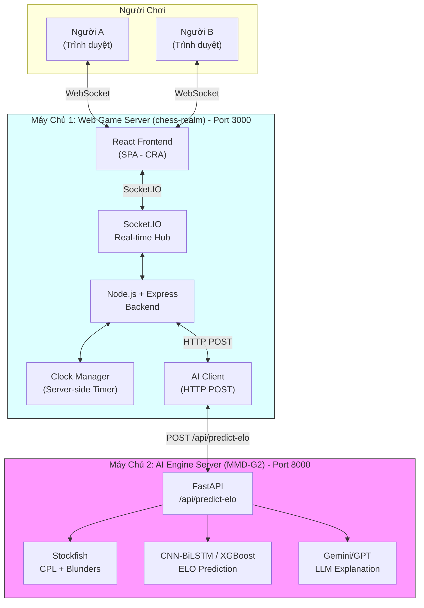

# Design: Web Game Server — Chess Multiplayer với AI ELO Prediction

## Architecture Overview

### High-Level System Structure



### Components và Trách nhiệm

| Component | Trách nhiệm | File |
|-----------|-------------|------|
| `React Frontend` | SPA router, Lobby, GameBoard, Clock UI, ResultModal, MoveHistory | `client/src/` |
| `Socket.IO Client` | Kết nối WebSocket, emit/receive events, auto-reconnect | `client/src/socket.js` |
| `Node.js Backend` | HTTP server, serve React build, route logic | `server/index.js` |
| `Room Manager` | Tạo/xóa phòng, gán màu quân, track players, handle disconnect/reconnect | `server/roomManager.js` |
| `Game Logic` | Validate move, detect game over, build PGN | `server/gameLogic.js` |
| `Clock Manager` | Server-side timer: start/stop/switch, record timeSpent | `server/clockManager.js` |
| `AI Client` | Gọi HTTP POST sang AI Engine, handle timeout/fallback | `server/aiClient.js` |

### Technology Stack

| Layer | Công nghệ | Phiên bản | Lý do |
|-------|-----------|-----------|-------|
| **Frontend Framework** | React + CRA | 18.3.1 | Giữ nguyên codebase hiện tại, không migrate Vite |
| **UI Library** | MUI v5 | 5.15.17 | Đã dùng, giữ nguyên |
| **Chess Board** | react-chessboard | 4.5.0 | Đã dùng, giữ nguyên. Dùng `onPromotion` callback để auto-promote Queen |
| **Chess Logic** | chess.js | 1.0.0-beta.8 | Đã dùng, giữ nguyên |
| **Real-time** | Socket.IO | 4.7.5 | Đã dùng, giữ nguyên |
| **Backend** | Node.js + Express | Latest | Đã có, mở rộng |
| **HTTP Client** | native `fetch` | Built-in | Gọi AI Engine API |
| **Routing** | react-router-dom | v6 | SPA navigation với `/room/:roomId` |

---

## Data Models

### 1. Room Entity (Server-side)

```javascript
// server/roomManager.js

// rooms: Map<roomId, Room>
const rooms = new Map();

/**
 * @typedef {Object} Room
 * @property {string} id              - Mã phòng (UUID, 6-8 ký tự)
 * @property {'waiting'|'playing'|'finished'} status
 * @property {{ white: string|null, black: string|null }} players
 *                                         - socket.id của từng người chơi
 *                                         - = null khi disconnect, = newSocketId khi reconnect
 * @property {{ white: string|null, black: string|null }} sessionTokens
 *                                         - session token để restore sau reconnect
 * @property {string[]} moves          - Mảng SAN notation: ["e4", "e5", "Nf3", ...]
 * @property {number[]} clockTimes    - Mảng thời gian suy nghĩ (giây), xen kẽ Trắng→Đen
 * @property {string} fen             - FEN string trạng thái hiện tại
 * @property {{ initial: number, increment: number }} timeControl
 *                                         - Ví dụ: { initial: 900, increment: 0 } (15 phút)
 * @property {number} whiteTimeLeft   - Giây còn lại của Trắng
 * @property {number} blackTimeLeft   - Giây còn lại của Đen
 * @property {number|null} lastMoveTimestamp - Date.now() khi nước cuối được đi
 * @property {'w'|'b'} currentTurn    - Lượt đi hiện tại
 * @property {string|null} result      - "1-0" | "0-1" | "1/2-1/2"
 * @property {string|null} resultReason - "checkmate" | "timeout" | "resign" | "stalemate"
 * @property {number} createdAt       - Timestamp tạo phòng (để tính room timeout)
 * @property {number|null} finishedAt  - Timestamp game over (để tính cleanup sau 5 phút)
 */

/**
 * Disconnect tracking — giữ session token để detect reconnect
 * @typedef {Object} DisconnectSession
 * @property {string} roomId         - Phòng player đang ở
 * @property {string} color          - "white" | "black"
 * @property {string} sessionToken   - Token để restore
 * @property {number} disconnectedAt  - Timestamp khi disconnect
 */
const disconnectedSessions = new Map(); // key = sessionToken, value = DisconnectSession

/**
 * Room cleanup timers — Map<roomId, setTimeoutId>
 */
const roomCleanupTimers = new Map(); // Xóa room sau timeout không ai reconnect
```

**Rationale Issue 2:** `playerSids` trùng lặp với `players`. Với session token, ta dùng `players[color]` làm nguồn socket.id chính. Khi disconnect → set null. Khi reconnect → gán socket.id mới. Đơn giản, ít state hơn, giảm bug surface.

### 2. Clock State (Server-side)

```javascript
// server/clockManager.js

/**
 * @typedef {Object} ClockState
 * @property {number} whiteTimeLeft  - Giây còn lại phe Trắng
 * @property {number} blackTimeLeft  - Giây còn lại phe Đen
 * @property {'white'|'black'|null} activeSide - Bên đang chạy đồng hồ
 * @property {number|null} intervalId - setInterval ID (để clear)
 * @property {number|null} lastTick   - Timestamp của tick cuối (để tính drift)
 * @property {'running'|'paused'|'stopped'} clockStatus
 */

/**
 * Mỗi room có 1 ClockState được quản lý bởi clockManager.
 * Clock chạy server-side, tránh client-side manipulation.
 * Clock PAUSE khi player disconnect, RESUME khi reconnect.
 * Clock TIẾP TỤC chạy cho bên còn lại khi 1 player disconnect.
 */
```

### 3. AI Request / Response

```javascript
// POST /api/predict-elo

// Request body
const aiRequest = {
  pgn: "1. e4 e5 2. Nf3 Nc6 3. Bb5 a6 4. Ba4 Nf6",
  clock_times: [5.2, 3.1, 12.0, 8.5, 2.1, 45.3],
  result: "1-0",
  time_control: "15+0",
};

// Success response
const aiResponse = {
  success: true,
  data: {
    white_elo: 1540,
    black_elo: 1200,
    eco: { code: "B50", name: "Sicilian Defense" },
    stats: {
      white_avg_cpl: 25.3,
      black_avg_cpl: 78.1,
      white_blunders: 0,
      black_blunders: 3,
      total_moves: 42,
    },
    explanation: "Trắng khai cuộc Phòng thủ Sicilian biến thể B50...",
  },
};

// Error response
const aiErrorResponse = {
  success: false,
  error: "Stockfish engine not available",
};
```

---

## API Design

### Socket.IO Events

#### a) Kết nối & Phòng chơi

| Event | Direction | Payload | Mô tả |
|-------|-----------|---------|-------|
| `create_room` | Client → Server | `{}` | Yêu cầu tạo phòng mới |
| `room_created` | Server → Client | `{ roomId: string, sessionToken: string }` | Trả mã phòng + session token, hiển thị link mời |
| `join_room` | Client → Server | `{ roomId: string }` | Yêu cầu vào phòng |
| `joined` | Server → Client | `{ color: "white"\|"black", roomId, fen, sessionToken, whiteTime, blackTime, moves, clockTimes }` | Xác nhận đã vào, gán màu quân, gửi full game state |
| `opponent_joined` | Server → Client | `{ fen, whiteTime, blackTime }` | Đối thủ đã vào, bắt đầu ván đấu |
| `room_full` | Server → Client | `{ message: string }` | Từ chối nếu phòng đã đầy |
| `room_not_found` | Server → Client | `{ message: string }` | Phòng không tồn tại |

#### b) Trong ván đấu

| Event | Direction | Payload | Mô tả |
|-------|-----------|---------|-------|
| `make_move` | Client → Server | `{ move: string, fen: string }` | Người chơi gửi nước đi. `move` = SAN (VD: "e4", "Nf3", "O-O", "e7e8q") |
| `move_made` | Server → Opponent | `{ move: string, san: string, fen: string, whiteTime: number, blackTime: number, activeSide: string }` | Broadcast nước đi + cập nhật đồng hồ |
| `clock_update` | Server → Both | `{ whiteTime: number, blackTime: number, activeSide: string }` | Sync đồng hồ định kỳ mỗi 1 giây |
| `resign` | Client → Server | `{}` | Người chơi xin thua |
| `exit_room` | Client → Server | `{}` | Người chơi chủ động thoát phòng |
| `opponent_left` | Server → Client | `{}` | Đối thủ đã thoát phòng |
| `invalid_move` | Server → Client | `{ message: string }` | Nước đi không hợp lệ |

#### c) Kết thúc ván

| Event | Direction | Payload | Mô tả |
|-------|-----------|---------|-------|
| `game_over` | Server → Both | `{ result: string, reason: string }` | Thông báo ván kết thúc |
| `ai_loading` | Server → Both | `{}` | Báo hiện overlay Loading |
| `ai_result` | Server → Both | `{ white_elo, black_elo, eco, stats, explanation }` | Trả kết quả AI, hiện Result Modal |
| `ai_error` | Server → Both | `{ message: string }` | AI Engine lỗi, hiện fallback |

#### d) Disconnect / Reconnect

| Event | Direction | Payload | Mô tả |
|-------|-----------|---------|-------|
| `opponent_disconnected` | Server → Client | `{}` | Đối thủ mất kết nối, clock của họ bị pause |
| `opponent_reconnected` | Server → Client | `{}` | Đối thủ đã reconnect, clock resume |
| `reconnect` | Client → Server | `{ roomId: string, sessionToken: string }` | Client reconnect, gửi session token để restore |
| `reconnected` | Server → Client | `{ color, roomId, fen, whiteTime, blackTime, moves, clockTimes, activeSide }` | Full game state restore |

#### e) Reset / Play Again

| Event | Direction | Payload | Mô tả |
|-------|-----------|---------|-------|
| `play_again` | Client → Server | `{}` | Yêu cầu chơi lại |
| `reset_game` | Server → Both | `{ fen, whiteTime, blackTime, activeSide }` | Reset bàn cờ + clock |

### REST Endpoints

| Method | Path | Mô tả | Response |
|--------|------|--------|----------|
| GET | `/` | Serve React app (SPA fallback) | HTML |
| GET | `/health` | Health check | `{ "status": "ok", "timestamp": "..." }` |

---

## Component Breakdown

### Backend Components

#### `server/index.js` — Entry Point
- Setup Express + Socket.IO (port **3000**)
- Serve React static build từ `client/dist/`
- Mount REST routes
- Socket.IO connection handler
- Import và delegate đến `roomManager`, `gameLogic`, `clockManager`, `aiClient`
- Handle disconnect: giữ room state, KHÔNG xóa phòng

#### `server/roomManager.js` — Quản lý Phòng
```javascript
// API surface:
createRoom() → { roomId, sessionToken }
getRoom(roomId) → Room | null
joinRoom(roomId, socket) → { success, color, sessionToken, error }
exitRoom(roomId, color) → { action: 'waiting'|'playing'|'finished' }
//   - Nếu status === 'waiting': xóa phòng
//   - Nếu status === 'playing': opponent thắng do resign
handleDisconnect(roomId, color) → void
//   - Set players[color] = null
//   - Nếu cả 2 đều null: đặt cleanup timer 30 giây
//   - Nếu 1 bên còn: pause clock của bên out
cancelCleanupTimer(roomId) → void
restoreSession(sessionToken, newSocketId) → { success, roomState, color } | null
getPlayerColor(roomId, socketId) → "white" | "black" | null
getRoomStateForReconnect(roomId, color) → { fen, moves, clockTimes, whiteTime, blackTime, activeSide }
cleanupRoom(roomId) → void
scheduleRoomCleanup(roomId, delayMs) → void
//   - Xóa phòng sau delay (30 giây nếu cả 2 disconnect, 5 phút nếu game_over không ai vào)
scheduleFinishedRoomCleanup(roomId) → void
//   - Sau game_over, đặt timer 5 phút → cleanupRoom
```

**Rationale Issue 4:** `leaveRoom()` là artifact từ design cũ. Logic exit room được thực hiện qua `exitRoom()` (chủ động) và `handleDisconnect()` (bị động). Không cần method trung gian.

#### `server/gameLogic.js` — Logic Cờ
```javascript
// API surface:
validateMove(fen, san) → { valid: boolean, error?: string }
makeMove(room) → { newFen, isCheck, isCheckmate, isStalemate }
detectGameOver(room) → { isOver: boolean, result?: string, reason?: string }
buildPGN(moves[]) → string  // "1. e4 e5 2. Nf3 Nc6 O-O"

// Internals:
- Dùng chess.js để kiểm tra luật
- Parse promotion moves (vd: "e7e8q") — gửi kèm suffix trong SAN
- Hỗ trợ Castling, En passant, Promotion
- Game over CHỈ detect bằng isCheckmate() và isStalemate()
- isDraw() KHÔNG trigger game_over tự động (chỉ khi player đồng ý — không trong phạm vi PoC)
```

#### `server/clockManager.js` — Server-side Clock
```javascript
// Time control: 15+0 (900 giây, 0 increment)
// API surface:
initClock(roomId, timeControl)  → void   // { initial: 900, increment: 0 }
startClock(roomId)              → void   // Bắt đầu countdown
pauseClock(roomId, side)       → void   // Tạm dừng clock của 1 bên (khi disconnect)
resumeClock(roomId, side)       → void   // Tiếp tục clock của 1 bên (khi reconnect)
pauseAllClock(roomId)          → void   // Tạm dừng cả 2 bên (khi cả 2 disconnect)
switchClock(roomId)             → { timeSpent: number }  // Chuyển bên, record thời gian
getTimes(roomId)                → { whiteTime: number, blackTime: number }
getActiveSide(roomId)           → 'white' | 'black' | null
stopClock(roomId)               → void
resetClock(roomId)              → void   // Reset về initial

// Internals:
- setInterval 1 giây → decrement activeSide time (CHỈ khi clockStatus === 'running')
- Khi về 0 → callback 'timeout' → trigger game_over
- Clock PAUSE khi player disconnect (chỉ pause phía disconnect, bên kia vẫn chạy)
- Clock RESUME khi player reconnect
```

**Rationale Issue 3:** `getClockStatus()` per-clock (1 giá trị chung) không đủ vì mỗi bên có thể có trạng thái khác nhau. Thay vào đó, chỉ cần `getActiveSide()` — frontend tự suy ra status từ context:
- `activeSide === 'white'` → Trắng đang chạy
- Opponent disconnect → frontend hiển thị status = 'paused' cho opponent
- Game over → frontend hiển thị status = 'stopped'

**Đây là tiếp cận đơn giản hóa tối đa phù hợp với mục tiêu PoC:** Server chỉ cần quản lý thời gian tuyệt đối (`whiteTimeLeft`, `blackTimeLeft`), không cần quản lý thêm trạng thái phức tạp.

#### `server/aiClient.js` — Gọi AI Engine
```javascript
// API surface:
async requestELOPrediction(room) → Promise<AIResult | null>

// Implementation:
// 1. buildPGN(room.moves)
// 2. HTTP POST http://AI_ENGINE_URL/api/predict-elo
//    body: { pgn, clock_times, result, time_control: "15+0" }
// 3. Timeout 30 giây
// 4. Return parsed JSON hoặc null nếu lỗi
```

### Frontend Components

#### `client/src/App.js` — Router chính
```jsx
// Routing (react-router-dom v6):
// /             → Lobby (InitGame)
// /room/:roomId → GameRoom

// On mount: check localStorage for sessionToken → emit reconnect if found
// Session token key: 'chess_session_token'
```

#### `client/src/socket.js` — Socket.IO Client Singleton
```javascript
// Singleton pattern — import từ bất kỳ component nào
// Tự động connect khi import, auto-reconnect khi mất kết nối
// Key functions:
// - getSocket() → Socket instance
// - setSessionToken(token) → lưu vào localStorage
// - getSessionToken() → đọc từ localStorage
// - clearSessionToken() → xóa khi thoát phòng
// Socket.IO config: { transports: ['websocket'], reconnection: true, reconnectionAttempts: 10, reconnectionDelay: 1000 }
// Auto-reconnect: khi reconnect_attempt, kiểm tra localStorage → emit 'reconnect'
```

#### `client/src/pages/Lobby.js` — Sảnh chờ
- **KHÔNG có username dialog** (xóa hoàn toàn)
- Nút lớn: `[ Tạo Phòng Mới ]`
- Input: nhập mã phòng + nút `[ Vào Phòng ]`
- Sau khi tạo phòng → redirect sang `/room/:roomId`

#### `client/src/pages/GameRoom.js` — Phòng đấu (Container)
- Header: Mã phòng + Màu quân của bạn
- Layout 3 cột: Thông tin Đen + Đồng hồ Đen | Bàn cờ | Đồng hồ Trắng + Thông tin Trắng
- Sidebar: Move History + Nút "Xin Thua" + Nút "Thoát Phòng"
- Handle Socket events: `move_made`, `clock_update`, `game_over`, `ai_result`, `ai_error`, `opponent_disconnected`, `opponent_reconnected`, `opponent_left`, `reset_game`, `reconnected`
- Handle AI loading state: hiện/ẩn overlay
- On mount: check localStorage for sessionToken, emit `reconnect` if found

#### `client/src/components/ChessBoard.js` — Bàn cờ
- Wrapper quanh `react-chessboard`
- Props: `position` (FEN), `orientation`, `onPieceDrop(source, target)`, `onPromotion(from, to)`
- Auto-flip board khi là phe Đen
- Kích thước: 480×480px
- **Auto-promote Queen**: `onPromotion={(from, to) => 'q'}` — return 'q' tự động lên Hậu
- **Check indicator**: Dùng `chess.inCheck()` để detect. react-chessboard v4.5.0 không có built-in check indicator nên cần custom overlay:
  - Tính vị trí vua (dùng chess.js `board.king(color)`)
  - Overlay CSS position absolute hoặc custom square style để highlight ô vua màu đỏ

#### `client/src/components/GameClock.js` — Đồng hồ (Server-sync)
- Props: `{ whiteTime, blackTime, activeSide }`
- `activeSide`: `'white' | 'black' | null`
- Frontend suy ra status từ context:
  - `activeSide === 'white'` → Đen: paused, Trắng: running
  - `activeSide === 'black'` → Trắng: paused, Đen: running
  - Opponent disconnect → opponent: paused
- Format: `MM:SS` (VD: `14:55`)
- Running: màu cam/sáng. Paused: màu xám. Stopped: màu đỏ.
- Chỉ hiển thị — không tự đếm ngược (server là nguồn sự thật)

**Rationale Issue 3 (Clock):** Không cần `getClockStatus()` trả về per-side status. Frontend biết `activeSide` từ server, và biết opponent có đang disconnected hay không. Từ 2 nguồn này → suy ra status cho mỗi bên. Đơn giản hóa phía server, chỉ quản lý `activeSide` và thời gian tuyệt đối.

#### `client/src/components/MoveHistory.js` — Lịch sử nước đi (SAN)
- Props: `moves: string[]` (mảng SAN: ["e4", "e5", "Nf3", ...])
- Format: 2 cột (cột số + cột Trắng + cột Đen)
- VD:
  ```
  1. e4    e5
  2. Nf3   Nc6
  3. Bb5   a6
  ```
- Auto-scroll xuống cuối khi có nước mới

#### `client/src/components/ResultModal.js` — Bảng kết quả
- Props: `{ result, reason, aiData, loading, error }`
- Khi `loading=true`: Spinner + "Đang phân tích ELO bằng AI..."
- Khi `aiData` có: Hiện ELO Trắng/Đen, ECO, CPL, Blunders, Explanation
- Khi `error`: Hiện kết quả cơ bản + thông báo fallback
- Nút: `[ Chơi Lại ]`

#### `client/src/components/WaitingOverlay.js` — Chờ đối thủ
- Hiện khi đã vào phòng nhưng đối thủ chưa vào
- Hiển thị link mời để copy + nút Copy

#### `client/src/components/DisconnectedOverlay.js` — Đối thủ đã disconnect
- Hiện khi nhận `opponent_disconnected`
- Text: "Đối thủ đã disconnect. Đang chờ reconnect..."

---

## Design Decisions

### Decision 1: Giữ nguyên CRA — không migrate Vite
- **Chọn:** Giữ CRA (react-scripts)
- **Lý do:** Repo đã chạy ổn định, không cần thay đổi build tool
- **Trade-off:** Vite có hot reload nhanh hơn, nhưng không đáng effort cho codebase đang chạy tốt

### Decision 2: Server-side Clock là nguồn sự thật
- **Chọn:** Server quản lý đồng hồ, client chỉ hiển thị (nhận `clock_update` mỗi 1 giây)
- **Lý do:** Tránh người chơi dùng DevTools hack thời gian
- **Trade-off:** Tăng độ phức tạp, nhưng cần thiết cho PoC Demo đáng tin cậy

### Decision 3: Clock Pause/Resume khi Disconnect
- **Chọn:** Khi 1 player disconnect: clock bên đó PAUSE, bên kia TIẾP TỤC chạy
- **Lý do:** Tránh griefing (player disconnect để "pause" clock). Bên còn lại không bị thiệt.
- **Alternative considered:** Pause tất cả → REJECTED vì cho phép exploit
- **Edge case:** Cả 2 disconnect → clock dừng hẳn → server xóa phòng sau 30 giây

### Decision 4: Session Token cho Reconnect
- **Chọn:** Mỗi player được gán session token (UUID v4) khi vào phòng, lưu vào `localStorage`
- **Lý do:** Socket ID thay đổi sau reconnect, cần cách khác để identify player
- **Flow:**
  1. Join room → Server sinh `sessionToken`, lưu vào `room.sessionTokens[color]`
  2. Client lưu vào `localStorage` key `'chess_session_token'`
  3. Disconnect → Socket mất
  4. Reconnect (F5 hoặc mất mạng) → Client gửi `sessionToken` lên server
  5. Server lookup → restore game state → gán lại `socketId`

### Decision 5: Room Lifecycle & Cleanup
- **Chọn:** Nhiều tầng cleanup:
  - `waiting` → 5 phút không ai join → xóa
  - `playing` → cả 2 disconnect → 30 giây không reconnect → xóa
  - `finished` → 5 phút không ai vào lại → xóa
- **Lý do:** Không để memory leak từ phòng bị bỏ quên

### Decision 6: PGN Format — SAN notation
- **Chọn:** "1. e4 e5 2. Nf3 Nc6 O-O" (không có header metadata)
- **Lý do:** Đơn giản, chess.js hỗ trợ build trực tiếp, dễ debug
- **Lưu ý:** Không cần header [Event], [Date], [White], [Black]

### Decision 7: AI Client dùng native `fetch`
- **Chọn:** Dùng `fetch()` thay vì `axios`
- **Lý do:** Không cần thêm dependency, `fetch` có sẵn trong Node.js 18+
- **Timeout:** Dùng `AbortSignal.timeout(30000)` — 30 giây

### Decision 8: Auto-promote Queen qua `onPromotion` callback
- **Chọn:** Dùng `onPromotion` callback của react-chessboard: khi được gọi, return `'q'`
- **Lý do:** react-chessboard v4.5.0 yêu cầu callback để handle promotion. Return `'q'` auto-promote Queen.
- **Code pattern:**
  ```jsx
  function onDrop(sourceSquare, targetSquare) {
    const move = makeAMove({ from: sourceSquare, to: targetSquare, promotion: 'q' });
    return move != null;
  }
  // VÀ
  <Chessboard onPromotion={(from, to) => 'q'} onPieceDrop={onDrop} />
  ```

### Decision 9: React Router cho SPA Navigation
- **Chọn:** Dùng `react-router-dom` v6
- **Lý do:** URL dạng `/room/:roomId` cho phép share link trực tiếp
- **Direct access:** Mở `/room/:roomId` trực tiếp → auto-join phòng

### Decision 10: Exit Room — Resign khi đang chơi
- **Chọn:** Bấm "Thoát Phòng" khi đang `playing` → xử lý như resign
- **Lý do:** Đơn giản, không cần thêm logic phức tạp
- **Alternative:** Tạo rời 2 action "Thoát" và "Xin Thua" → Có thể thêm sau nếu cần

---

## Non-Functional Requirements

### Performance
- WebSocket latency: < 100ms (local network)
- Chess move validation: < 10ms
- Game start: < 2s sau khi người thứ 2 join
- AI Engine response timeout: 30 giây (vẫn hiện kết quả cơ bản)
- Clock sync interval: 1 giây

### Scalability
- Hỗ trợ 10–20 concurrent rooms
- Mỗi room tối đa 2 players
- Stateless server ngoại trừ in-memory rooms

### Security (Local Demo)
- Không có authentication
- CORS cho phép tất cả origins
- Server-side clock chống manipulation
- Session token trong localStorage (không bảo mật cao, chấp nhận cho PoC)

### Usability
- Không login/registration
- Giao diện tối giản: Lobby → Game → Result
- Clear error messages khi lỗi
- Loading states khi chờ AI
- Visual indicator khi đối thủ disconnect

### Browser Support
- Chrome 90+, Firefox 88+, Safari 14+, Edge 90+ (desktop only)

---

## Error Codes

| Code | Message | Trường hợp |
|------|---------|------------|
| `ROOM_NOT_FOUND` | Phòng không tồn tại | Nhập mã phòng sai |
| `ROOM_FULL` | Phòng đã đầy | Cố gắng join phòng đã có 2 người |
| `INVALID_MOVE` | Nước đi không hợp lệ | Di chuyển sai luật |
| `NOT_YOUR_TURN` | Chưa đến lượt bạn | Cố gắng đi khi chưa đến lượt |
| `AI_ERROR` | Không thể kết nối AI Engine. Phân tích ELO tạm thời không khả dụng. | AI Engine timeout/lỗi |

---

## File Structure (Target)

```
chess-realm/
├── server/                          # Backend Node.js — Port 3000
│   ├── index.js                     # Entry: Express + Socket.IO setup, disconnect handling
│   ├── roomManager.js               # Quản lý phòng + disconnect/reconnect + cleanup timers
│   ├── gameLogic.js                 # Validate move, detect game over (checkmate/stalemate), build PGN
│   ├── clockManager.js              # Server-side clock (pause/resume, time tracking)
│   ├── aiClient.js                  # HTTP client gọi AI Engine
│   └── package.json
│
├── client/                          # Frontend React + CRA
│   ├── src/
│   │   ├── App.js                   # Router (Lobby vs GameRoom)
│   │   ├── pages/
│   │   │   ├── Lobby.js
│   │   │   └── GameRoom.js
│   │   ├── components/
│   │   │   ├── ChessBoard.js
│   │   │   ├── GameClock.js
│   │   │   ├── MoveHistory.js
│   │   │   ├── ResultModal.js
│   │   │   ├── WaitingOverlay.js  # Chờ đối thủ
│   │   │   ├── DisconnectedOverlay.js
│   │   │   └── ReconnectingOverlay.js
│   │   ├── socket.js
│   │   └── index.js
│   ├── public/
│   │   └── index.html
│   └── package.json
│
├── package.json                     # Root: concurrently dev server + client
└── README.md
```
