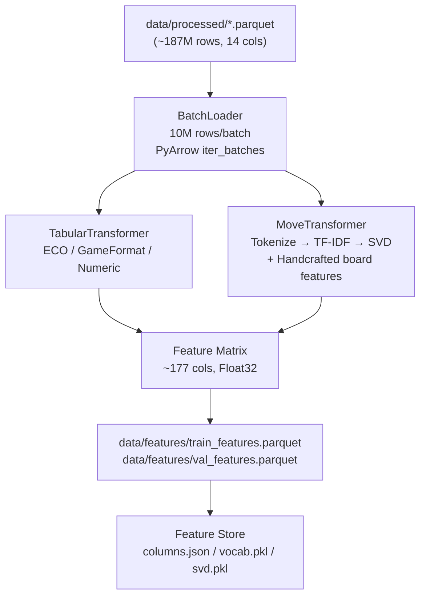
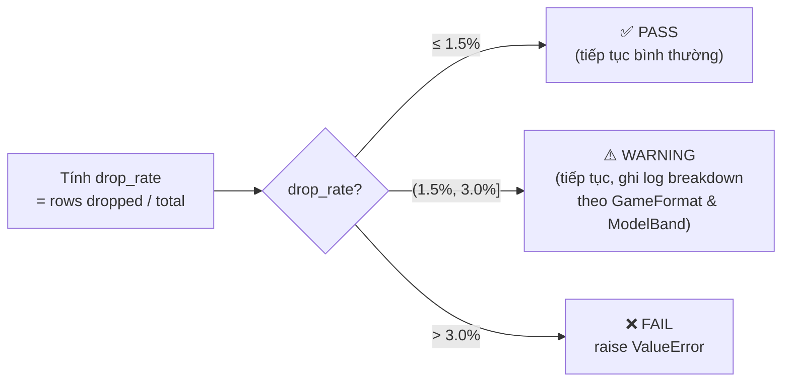

# Báo Cáo Tổng Hợp: Feature Engineering — ELO Prediction

> **Ngày tạo**: 11/03/2026  
> **Phạm vi**: Toàn bộ module feature engineering (Phase 1–4)  
> **Trạng thái**: Hoàn tất FE-only scope; chờ full-scale run & model training

---

## 1. Bối Cảnh & Mục Tiêu

### Bài toán
Phân lớp **ELO người chơi cờ vua** thành 5 bands (`ModelBand`) dựa trên chuỗi **N nước đi đầu tiên** (SAN notation) và metadata ván đấu — **không** sử dụng ELO thực tế làm input để tránh data leakage.

### Baseline & Mục tiêu

| Mốc | Accuracy | Ghi chú |
|-----|----------|---------|
| EDA baseline (XGBoost tabular, 18 features) | **44.18%** | Dùng làm điểm so sánh |
| Mục tiêu tối thiểu | **≥ 60%** | Tiêu chí nghiệm thu |
| Smoke rebaseline (3K rows, Iter 1) | 37.23% | Sample quá nhỏ, không đại diện |
| Smoke tuning Iter 2 (n_ply=18, depth=7) | 38.30% | Tốt nhất trong smoke |

### Target Classes

| ID | Nhãn | Khoảng ELO |
|----|------|-----------|
| 0 | Beginner | 0 – 1,000 |
| 1 | Intermediate | 1,000 – 1,400 |
| 2 | Advanced | 1,400 – 1,800 |
| 3 | Expert | 1,800 – 2,200 |
| 4 | Master | 2,200+ |

### Dữ liệu
| Tập | File | Số rows |
|-----|------|---------|
| Train | `lichess_2025-12_ml.parquet` | ~93.9M |
| Validation | `lichess_2026-01_ml.parquet` | ~93.4M |
| **Tổng** | | **~187M rows** |

---

## 2. Kiến Trúc Pipeline Tổng Thể



### Các class chính trong `src/feature_engineering.py`

| Class | Trách nhiệm |
|-------|-------------|
| `BatchLoader` | Đọc Parquet theo từng batch qua `PyArrow.iter_batches()` |
| `TabularTransformer` | Xử lý ECO, GameFormat, các cột numeric (fit/transform) |
| `MoveTransformer` | Tokenize SAN, TF-IDF + SVD, trích xuất board-state features |
| `FeaturePipeline` | Orchestrator: temporal split → quality gate → batch process → save artifacts |

---

## 3. Tabular Features

### 3.1 Tổng quan

**Tổng cột tabular**: ~114 cols

| Nhóm | Cột output | Số cột |
|------|-----------|--------|
| ECO top-100 one-hot | `eco_A00`, `eco_B12`, … | 100 |
| EcoCategory one-hot (A–E) | `eco_cat_A` … `eco_cat_E` | 5 |
| GameFormat one-hot | `gf_Bullet`, `gf_Blitz`, `gf_Rapid`, `gf_Classical`, `gf_UltraBullet`, `gf_Unknown` | 5–6 |
| BaseTime log1p | `basetime_log` | 1 |
| Increment log1p | `increment_log` | 1 |
| NumMoves normalized | `num_moves_norm` | 1 |
| EloDiff (offline only) | `elo_diff_norm` | 1 (tùy chọn) |

### 3.2 Chi tiết xử lý từng nhóm

**ECO Code**
- Lấy **top-N ECO** theo tần suất trong train (default N=100)
- Fit trên train, transform cố định schema → tránh drift schema train/val
- Các ECO ngoài top-N → gộp vào `eco_other` (hoặc bỏ)

**EcoCategory (A–E)**
- Luôn có đủ 5 cột (A, B, C, D, E)
- Trích từ ký tự đầu của ECO code

**GameFormat**
- `gf_Unknown` luôn được đưa vào vocabulary
- Phân loại: Bullet / Blitz / Rapid / Classical / UltraBullet / Unknown

**Numeric Features**
- `basetime_log`: `log1p(basetime)`, clip tại quantile 99% (~10,800s)
- `increment_log`: `log1p(increment)`, clip tại quantile 99% (~180s)
- `num_moves_norm`: `clip(num_moves, 0, 100) / 100`

**EloDiff (chống data leakage)**
- `elo_diff_norm = |whiteELO - blackELO| / 3500`
- Chỉ xuất khi `realtime_mode=False` → bảo đảm không leak ELO vào inference thực tế

---

## 4. Move Sequence Features

### 4.1 Tokenization Pipeline

```
Raw moves string
    ↓ _clean_moves_text()   — Bỏ số nước (1., 2., ...), kết quả (1-0, 0-1, 1/2), chuẩn hóa 0-0 → O-O
    ↓ _normalize_token()    — Bỏ annotation noise (!, ?, !!, !?, ?!) cuối token
    ↓ Lấy first n_ply=15 tokens
    ↓ [token_1, token_2, ..., token_15]
```

### 4.2 TF-IDF + SVD (Latent Semantic Analysis)

| Tham số | Giá trị mặc định |
|---------|-----------------|
| N-gram range | (1, 2) — unigram + bigram |
| max_features | 500 |
| min_df | 2 |
| max_df | 0.95 |
| sublinear_tf | True |
| SVD dims | 50 |
| Fit sample | 500,000 rows từ train |

**Output**: `svd_0` … `svd_49` — 50 cột Float32

### 4.3 Handcrafted Board-State Features

| Feature | Mô tả | # Cột |
|---------|-------|-------|
| `svd_0` … `svd_49` | LSA của chuỗi nước đi | 50 |
| `move_entropy` | Shannon entropy của unigram distribution trong ván | 1 |
| `has_castles_ks` | Có nhập thành cánh vua trong 20 ply đầu (python-chess) | 1 |
| `has_castles_qs` | Có nhập thành cánh hậu trong 20 ply đầu (python-chess) | 1 |
| `check_count_15ply` | Số lần chiếu tướng trong 15 ply đầu | 1 |
| `pawn_push_ratio` | Tỷ lệ nước đi tốt / tổng trong 10 ply đầu | 1 |
| `first_move_e4` | Nước đi đầu là e4 | 1 |
| `first_move_d4` | Nước đi đầu là d4 | 1 |
| `first_move_Nf3` | Nước đi đầu là Nf3 | 1 |
| `first_move_c4` | Nước đi đầu là c4 | 1 |
| `first_move_other` | Nước đi đầu khác | 1 |
| `unique_move_ratio` | Tỷ lệ token duy nhất / tổng token | 1 |
| `capture_ratio` | Tỷ lệ token có ký tự `x` (bắt quân) | 1 |
| `check_symbol_ratio` | Tỷ lệ token có `+` hoặc `#` | 1 |

**Tổng move features**: 63 cột (50 SVD + 13 thủ công)

---

## 5. Feature Store & Data Quality Gate

### 5.1 Temporal Split
| Điều kiện | Tập |
|----------|-----|
| Tên file chứa `2025-12` | Train |
| Tên file chứa `2026-01` | Validation |
| Khác | Bỏ qua |

### 5.2 Data Quality Gate (min_required_ply = 5)



### 5.3 Feature Store Artifacts

```
data/features/
├── train_features.parquet      # ~93.9M rows × 177 cols
├── val_features.parquet        # ~93.4M rows × 177 cols
├── feature_columns.json        # Danh sách cột theo thứ tự cố định
├── tfidf_vocabulary.pkl        # TF-IDF vocabulary (fit trên 500K train rows)
└── svd_components.pkl          # TruncatedSVD(50) components matrix
```

### 5.4 Cấu hình Mặc định (`src/feature_config.py`)

| Tham số | Giá trị |
|---------|---------|
| `N_MOVES_DEFAULT` | 15 ply |
| `ECO_TOP_N_DEFAULT` | 100 ECO codes |
| `TFIDF_SAMPLE_SIZE_DEFAULT` | 500,000 rows |
| `SVD_DIM_DEFAULT` | 50 |
| `BATCH_SIZE_DEFAULT` | 10,000,000 rows |
| `TFIDF_MAX_FEATURES_DEFAULT` | 500 |
| `TFIDF_NGRAM_MIN_DEFAULT` | 1 |
| `TFIDF_NGRAM_MAX_DEFAULT` | 2 |
| `TFIDF_MIN_DF_DEFAULT` | 2 |
| `TFIDF_MAX_DF_DEFAULT` | 0.95 |
| `random_seed` | 42 |
| `min_required_ply` | 5 |
| `drop_rate_pass_threshold` | 1.5% |
| `drop_rate_fail_threshold` | 3.0% |

---

## 6. Kết Quả Rebaseline Smoke

> **Lưu ý**: Các kết quả dưới đây trên **sample 3,000 rows train + 3,000 rows val** — chỉ mang tính thiết kế, không phải nghiệm thu FE-only chính thức.

### 6.1 Ablation Study (Iteration 1)

| Cấu hình | Accuracy | Macro-F1 | Số features |
|----------|----------|---------|------------|
| tabular_only | 0.2937 | 0.2785 | 114 |
| **tabular_plus_sequence** | **0.3723** | **0.3068** | **177** |
| all_features | 0.3723 | 0.3068 | 177 |

**Kết luận**: Move sequence features giúp tăng **+7.9% accuracy** và **+2.8% macro-F1** so với tabular-only.

### 6.2 Chi tiết per-class (Iteration 1, 3K val rows)

| Class | Precision | Recall | F1-score | Support |
|-------|-----------|--------|---------|---------|
| 0 — Beginner | 0.157 | 0.113 | 0.131 | 160 |
| 1 — Intermediate | 0.313 | 0.335 | 0.324 | 600 |
| 2 — Advanced | 0.405 | 0.398 | 0.401 | 1,086 |
| 3 — Expert | 0.403 | 0.438 | 0.420 | 890 |
| 4 — Master | 0.293 | 0.231 | 0.259 | 264 |
| **Macro avg** | **0.314** | **0.303** | **0.307** | **3,000** |
| **Weighted avg** | **0.367** | **0.372** | **0.369** | **3,000** |

**Nhận xét**: Class 2 (Advanced) và 3 (Expert) có F1 tốt nhất — đây là 2 class đông nhất. Class 0 (Beginner) khó nhận diện nhất (F1 = 0.131).

### 6.3 Top 20 Feature Importance (XGBoost gain)

| Rank | Feature | Gain | Nhóm |
|------|---------|------|------|
| 1 | `gf_Bullet` | 19.80 | GameFormat |
| 2 | `basetime_log` | 12.27 | Numeric |
| 3 | `eco_C22` | 5.89 | ECO |
| 4 | `first_move_e4` | 5.64 | Move |
| 5 | `num_moves_norm` | 5.60 | Numeric |
| 6 | `eco_cat_C` | 5.09 | ECO Category |
| 7 | `increment_log` | 4.36 | Numeric |
| 8 | `svd_1` | 4.28 | LSA |
| 9 | `eco_A04` | 3.85 | ECO |
| 10 | `svd_2` | 3.78 | LSA |
| 11 | `eco_A15` | 3.72 | ECO |
| 12 | `eco_A53` | 3.43 | ECO |
| 13 | `eco_D20` | 3.40 | ECO |
| 14 | `pawn_push_ratio` | 3.38 | Move |
| 15 | `eco_B02` | 3.30 | ECO |
| 16 | `eco_D00` | 3.28 | ECO |
| 17 | `svd_39` | 3.23 | LSA |
| 18 | `capture_ratio` | 3.22 | Move |
| 19 | `eco_A13` | 3.17 | ECO |
| 20 | `eco_A02` | 3.17 | ECO |

**Nhận xét critical**:
- `gf_Bullet` + `basetime_log` chiếm ~32% signal → TimeControl là signal hàng đầu
- ECO one-hot và EcoCategory đóng góp phần lớn top-20
- SVD features (`svd_1`, `svd_2`, `svd_39`) nằm trong top-20 → TF-IDF+SVD mang signal có ích
- `pawn_push_ratio` (rank 14), `capture_ratio` (rank 18) → handcrafted board features hữu ích

### 6.4 Hyperparameter Tuning — Iteration 2

Grid search 3 configs:

| Config | n_ply | N-gram | max_features | min_df | XGB depth | Accuracy | Macro-F1 |
|--------|-------|--------|-------------|--------|-----------|----------|---------|
| `cfg_a_1to2_df2` (baseline) | 15 | (1,2) | 500 | 2 | 6 | 0.3650 | 0.3075 |
| **`cfg_c_1to2_df1_deeper`** | **18** | **(1,2)** | **700** | **1** | **7** | **0.3830** | **0.3061** |
| `cfg_b_2to3_df1` | 15 | (2,3) | 600 | 1 | 6 | 0.3567 | 0.2965 |

**Thắng**: Config với `n_ply=18`, unigram+bigram, 700 TF-IDF features, XGB `max_depth=7`  
→ Accuracy cao hơn +1.8% so với baseline; bigram-only (cfg_b) kém hơn

---

## 7. Kiểm Thử

### Tổng quan
- **16 tests pass**, 1 warning (sklearn TruncatedSVD trên sample nhỏ — expected)
- Phân bổ: 4 TabularTransformer + 8 MoveTransformer + 4 FeaturePipeline

### `tests/test_tabular_transformer.py` — 4 tests

| Test | Mô tả |
|------|-------|
| `test_eco_and_category_one_hot` | Verify ECO top-N + eco_cat_A…E luôn có đủ 5 cột |
| `test_game_format_handles_unknown` | `gf_Unknown` xuất hiện và có giá trị > 0 |
| `test_numeric_transforms` | `basetime_log`, `increment_log`, `num_moves_norm` ≤ 1.0 |
| `test_elodiff_only_when_not_realtime` | `elo_diff_norm` chỉ xuất khi `realtime_mode=False` |

### `tests/test_move_transformer.py` — 8 tests

| Test | Mô tả |
|------|-------|
| `test_tokenize_strips_move_numbers_and_result` | Bỏ `1.`, `2.`, `1-0` → token list sạch |
| `test_tokenize_removes_annotation_noise` | Bỏ `!`, `?`, `!!`, `?!` cuối token |
| `test_bigram_generation` | Sliding window bigram từ token list |
| `test_entropy_non_negative` | Shannon entropy ≥ 0 |
| `test_transform_outputs_expected_shape` | svd_dim=8 → output shape (2, 21) = 8 SVD + 13 meta |
| `test_board_state_features_castling_detected` | `O-O` → `has_castles_ks=1.0`, `has_castles_qs=0.0` |
| `test_fit_enables_tfidf_svd_transform` | Fit + transform không lỗi; shape (4, 19) = 6 SVD + 13 meta |
| `test_token_meta_features_range` | `unique/capture/check_ratio` trong [0.0, 1.0] |

### `tests/test_feature_pipeline_phase4.py` — 4 tests

| Test | Mô tả |
|------|-------|
| `test_temporal_split_files` | `2025-12` → train, `2026-01` → val, `other` → bỏ qua |
| `test_quality_gate_pass_and_warning` | 1% drop → pass; 2% drop → warning |
| `test_quality_gate_fail` | 4% drop → raise `ValueError` |
| `test_process_split_and_metadata` | End-to-end: process → parquet → verify schema → save metadata artifacts |

---

## 8. Cấu Trúc Module & File

```
src/
├── feature_config.py       # Hằng số cấu hình (threshold, default params)
├── feature_engineering.py  # Pipeline chính: BatchLoader, TabularTransformer,
│                           #                 MoveTransformer, FeaturePipeline
├── config.py               # Cấu hình đường dẫn data / logging
├── preprocessing.py        # Tiền xử lý raw data → Parquet
└── rebaseline.py           # Re-train XGBoost + đánh giá trên feature store

tests/
├── test_tabular_transformer.py    # 4 unit tests — TabularTransformer
├── test_move_transformer.py       # 8 unit tests — MoveTransformer
└── test_feature_pipeline_phase4.py # 4 integration tests — FeaturePipeline

notebooks/feature-engineering/
└── rebaseline/
    ├── rebaseline_smoke.ipynb              # Smoke run + ablation study
    └── rebaseline_tuning_iteration2.ipynb  # Hyperparameter grid search

data/features/smoke/
├── feature_columns.json            # 177 columns (smoke vocab)
├── rebaseline_summary.json         # Kết quả Iter 1 (accuracy=0.3723)
└── tuning_iteration2_results.csv   # Kết quả Iter 2 (3 configs)
```

---

## 9. Trạng Thái Hoàn Thành

### ✅ Đã hoàn tất (FE-only scope)

| Phase | Nội dung | Trạng thái |
|-------|---------|-----------|
| Phase 1 | Pipeline skeleton, config, projection, target encoding | ✅ Hoàn tất |
| Phase 2 | TabularTransformer: ECO, EcoCategory, GameFormat, numeric, EloDiff offline | ✅ Hoàn tất |
| Phase 3 | MoveTransformer: tokenizer, bigram, entropy, python-chess, TF-IDF+SVD | ✅ Hoàn tất |
| Phase 4 | Feature store: temporal split, batch loader, quality gate, metadata, schema verify | ✅ Hoàn tất |
| Testing | 16 unit/integration tests pass | ✅ Hoàn tất |
| Smoke rebaseline | Ablation + tuning Iter 2 trên 3K rows | ✅ Hoàn tất |

### ❌ Deferred → Model Training Phase

| Hạng mục | Lý do chuyển pha |
|---------|-----------------|
| Re-baseline XGBoost trên full 187M rows | Cần infra đủ lớn, không thuộc FE scope |
| Ablation đầy đủ (full data) | Phụ thuộc full-scale feature generation |
| Best config xác nhận (n_ply=18, depth=7) | Cần full-run để validate |
| Benchmark SLA < 4 giờ | Smoke 3K rows không đại diện |
| So sánh với EDA baseline 44.18% | Cần full-run |
| Đạt mục tiêu accuracy ≥ 60% | Cần full-run + model tuning |

---

## 10. Rủi Ro & Hạn Chế Còn Lại

| Vấn đề | Mức độ | Ghi chú |
|--------|--------|---------|
| Smoke accuracy (0.37) < EDA baseline (0.44) | ⚠️ Quan sát | Sample 3K rows quá nhỏ, không đại diện. Kỳ vọng đảo ngược trên full data |
| SLA < 4 giờ chưa xác nhận | ⚠️ Trung bình | Cần benchmark trên 187M rows |
| ECO vocab khác nhau trên smoke vs full | ℹ️ Thiết kế | Smoke fit trên 3K rows → top-100 khác với full data. Sẽ tự fix khi full-run |
| `has_castles` dùng python-chess khá chậm | ⚠️ Performance | Có thể thay bằng regex đơn giản nếu cần tối ưu |
| Beginner class (class 0) F1 rất thấp (0.131) | ⚠️ Model quality | Có thể cần class weighting hoặc oversampling |

---

## 11. Cách Chạy Pipeline

```bash
# Kích hoạt môi trường conda
conda activate

# Chạy full feature pipeline (train + val)
python -m src.feature_engineering \
    --data_dir data/processed \
    --feature_dir data/features \
    --n_moves 15 \
    --eco_top_n 100 \
    --svd_dim 50

# Chạy rebaseline sau khi có feature store
python -m src.rebaseline \
    --feature_dir data/features \
    --output_dir data/results

# Chạy toàn bộ test suite
python -m pytest tests/ -v
```

---

## 12. Phụ Lục: Ma Trận Feature Đầy Đủ (177 cột)

| STT | Nhóm | Tên cột | Mô tả |
|-----|------|---------|-------|
| 1 | Target | `ModelBand` | 0–4 (Beginner…Master) |
| 2–101 | ECO | `eco_A00` … `eco_E99` | Top-100 ECO one-hot |
| 102–106 | ECO Category | `eco_cat_A` … `eco_cat_E` | EcoCategory A–E one-hot |
| 107–112 | GameFormat | `gf_Bullet`, `gf_Blitz`, `gf_Rapid`, `gf_Classical`, `gf_UltraBullet`, `gf_Unknown` | One-hot |
| 113 | Numeric | `basetime_log` | log1p(basetime), clipped |
| 114 | Numeric | `increment_log` | log1p(increment), clipped |
| 115 | Numeric | `num_moves_norm` | clip(num_moves,0,100)/100 |
| 116 | Move | `move_entropy` | Shannon entropy |
| 117 | Move | `has_castles_ks` | Nhập thành cánh vua ∈ {0,1} |
| 118 | Move | `has_castles_qs` | Nhập thành cánh hậu ∈ {0,1} |
| 119 | Move | `check_count_15ply` | Số lần chiếu trong 15 ply |
| 120 | Move | `pawn_push_ratio` | Tốt pushes / tổng (10 ply) |
| 121–125 | Move | `first_move_e4/d4/Nf3/c4/other` | Nước mở đầu one-hot (5 class) |
| 126 | Move | `unique_move_ratio` | Unique tokens / total |
| 127 | Move | `capture_ratio` | Tokens có 'x' / total |
| 128 | Move | `check_symbol_ratio` | Tokens có '+'/`#` / total |
| 129–178 | LSA | `svd_0` … `svd_49` | TruncatedSVD(50) từ TF-IDF |
