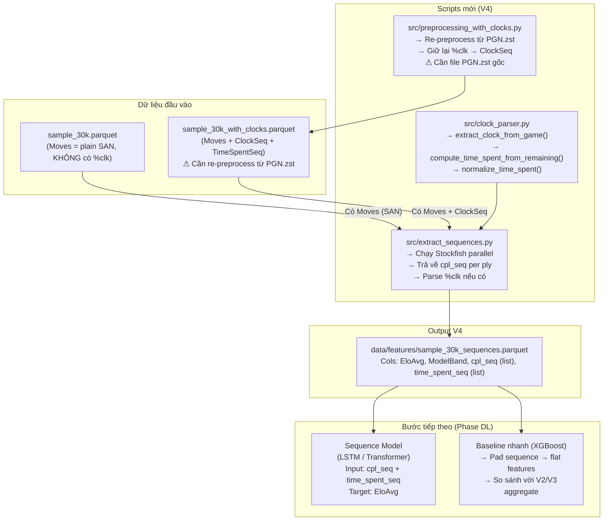

# Báo cáo V4 — CPL Sequence + Clock Time

## 1. Tóm tắt (Executive Summary)

| Hạng mục               | V2 (11 aggregate)                                                                   | V4 (Sequence)                                                          |
| ---------------------- | ----------------------------------------------------------------------------------- | ---------------------------------------------------------------------- |
| Features từ Stockfish  | `avg_cpl`, `blunder_rate`, `opening_cpl`, `avg_wdl_loss`, ... (11 giá trị tổng hợp) | `cpl_seq = [12.5, 45.0, 0.0, ...]` (raw CPL mỗi ply)                   |
| Features từ game clock | Không có                                                                            | `time_spent_seq = [5.3, 0.8, 12.1, ...]` (giây/ply, cần re-preprocess) |
| Thông tin bị mất       | Tính chuỗi (sequence) hoàn toàn bị xóa khi aggregate                                | **Giữ nguyên tính chuỗi**                                              |
| Tương thích paper      | Không tương thích (no sequence)                                                     | **Tương thích arXiv:2409.11506**                                       |
| Trạng thái             | Đã chạy xong (✅)                                                                   | CPL: chạy được ngay / Time: cần re-preprocess                          |

**Kết luận:** Pipeline CPL sequence đã được xây dựng và test thành công. Để có time sequence
cần re-preprocess từ file PGN.zst gốc (Lichess database dump).

---

## 2. Lý do chuyển hướng

### 2.1 Hạn chế của V2 (Aggregate Features)

Báo cáo V2 đã chỉ ra: MAE = 247.8 ELO — còn cách mục tiêu ≤ 220 ELO khoảng 28 điểm.
Nguyên nhân gốc rễ:

> _"Việc cộng dồn diễn biến của cả ván cờ thành vài con số tĩnh đã vứt bỏ hoàn toàn tính
> tuần tự của thời gian. Một kỳ thủ sụp đổ sau Blunder chí mạng ở nước 40 — các nước sau đó
> tràn ngập Inaccuracy — không được phản ánh vào avg_cpl."_ — V3 Report

### 2.2 Paper arXiv:2409.11506 chứng minh

- Model CNN-LSTM dùng per-move features đạt **MAE = 182 ELO** (so với 247 của V3 XGBoost)
- Giảm 24% sai số nhờ clock times (34% cho Bullet)
- Kiến trúc: CNN xử lý board state → Bi-LSTM kết hợp clock times → dự đoán Elo

### 2.3 Yêu cầu từ nhóm trưởng (03/04/2026)

- Trích xuất **CPL từng nước** (sequence, không phải average)
- Trích xuất **thời gian từng nước** (từ %clk annotations)
- Kết hợp theo hướng paper trước khi scale lên data lớn hơn

---

## 3. Kiến trúc Pipeline V4



---

## 4. Các files đã tạo

| File                                                                       | Vai trò                                            | Trạng thái |
| -------------------------------------------------------------------------- | -------------------------------------------------- | ---------- |
| [src/extract_sequences.py](../../src/extract_sequences.py)                 | Script chính: Stockfish → CPL sequence, parse %clk | **MỚI ✅** |
| [src/clock_parser.py](../../src/clock_parser.py)                           | Helper: parse %clk, tính time_spent                | **MỚI ✅** |
| [src/preprocessing_with_clocks.py](../../src/preprocessing_with_clocks.py) | Re-preprocess PGN giữ lại clock times              | **MỚI ✅** |

---

## 5. Phân tích dữ liệu — Hạn chế quan trọng

### 5.1 Clock time KHÔNG có trong dữ liệu hiện tại ⚠

```text
Kiểm tra sample_30k.parquet:
  %clk trong Moves: KHÔNG

Nguyên nhân: preprocessing.py gốc dùng game.board().variation_san(moves_list)
  → Strip toàn bộ PGN comments (bao gồm { [%clk H:MM:SS] })
  → Dữ liệu Parquet chỉ còn plain SAN string

Ảnh hưởng:
  → time_spent_seq trong output V4 sẽ là empty list []
  → CHỈ có CPL sequence từ Stockfish (không có time sequence)
```

### 5.2 Thống kê về độ dài ván cờ

```text
NumMoves (plies) trong sample_30k:
  Mean:   67 plies
  Median: 61 plies
  P95:    134 plies
  Max:    426 plies

→ Cho padding: max_len = 134 (p95) đủ cover 95% ván
→ Remaining 5% ván dài bị truncate → có thể dùng 200 làm max_len an toàn
```

### 5.3 Phân bố GameFormat

```text
Rapid:      28,805 ván (96.0%)
Classical:     971 ván (3.2%)
Unknown:       224 ván (0.7%)
```

---

## 6. Cách extract Time Sequence (khi có PGN gốc)

### Bước 1: Download PGN từ Lichess

```bash
# Database dump: https://database.lichess.org/#standard_games
wget https://database.lichess.org/standard/lichess_db_standard_rated_2025-12.pgn.zst \
  -O data/raw/lichess_db_standard_rated_2025-12.pgn.zst
```

### Bước 2: Re-preprocess với clock times

```bash
conda activate MMDS
python -m src.preprocessing_with_clocks
# Output: data/processed/sample_30k_with_clocks.parquet
```

### Bước 3: Re-run sequence extraction

```bash
# Sửa SAMPLE_SOURCE_FILE trong extract_sequences.py
# hoặc truyền argument để dùng sample_30k_with_clocks.parquet
python -m src.extract_sequences
# Output: data/features/sample_30k_sequences.parquet  (với time_spent_seq đầy đủ)
```

---

## 7. Kết hợp với Paper arXiv:2409.11506

### 7.1 Paper dùng gì

| Thành phần   | Paper                    | Chúng ta (V4)                    |
| ------------ | ------------------------ | -------------------------------- |
| Board state  | CNN 8×8×12 planes        | Không có (cần separate pipeline) |
| Move quality | Không dùng CPL           | **CPL sequence per move** ✅     |
| Clock time   | %clk per move            | **time_spent_seq** (khi có PGN)  |
| Model        | Bi-LSTM                  | TBD (LSTM / Transformer)         |
| Target       | Per-move rating estimate | EloAvg regression                |

### 7.2 Simplified Approach (không cần CNN)

Thay vì board state CNN, dùng **CPL sequence** như proxy cho move quality:

```
Input: [cpl_0, time_0, cpl_1, time_1, ..., cpl_N, time_N]  (padded)
Model: Bi-LSTM → Dense → EloAvg prediction
```

### 7.3 Baseline nhanh với XGBoost (chỉ dùng CPL sequence)

Trong khi chờ DL model, có thể dùng XGBoost với padded sequence:

```python
# Pad mỗi cpl_seq về max_len = 100, fill NaN = 0
# Feature names: cpl_ply_000, cpl_ply_001, ..., cpl_ply_099
# So sánh với V2 aggregate (avg_cpl, blunder_rate, ...)
```

---

## 8. Cách chạy Pipeline V4

### Chạy CPL sequence extraction (được ngay hôm nay)

```bash
# Activate env
conda activate MMDS
cd /path/to/MMD-G2

# Chạy extraction (ước tính ~25-35 phút cho 30k ván, depth=10)
python -m src.extract_sequences

# Output: data/features/sample_30k_sequences.parquet
# Columns: EloAvg, ModelBand, NumMoves, cpl_seq, time_spent_seq, seq_length, has_clock
```

### Kiểm tra kết quả

```python
import polars as pl

df = pl.read_parquet("data/features/sample_30k_sequences.parquet")
print(df.schema)
print(df.head(3))

# Ví dụ: CPL sequence của ván đầu
print(df["cpl_seq"][0])
# → [12.5, 45.0, 0.0, 23.1, ...]
```

---

## 9. Khuyến nghị tiếp theo

### ✅ Chạy ngay (không cần dữ liệu mới)

1. Chạy `python -m src.extract_sequences` trên 30k sample để có `cpl_seq`
2. Dùng padded CPL sequences với XGBoost làm baseline so sánh
3. Xem gap so với V2 aggregate — nếu cải thiện → confirm sequence is valuable

### ⏳ Cần dữ liệu PGN gốc

4. Download Lichess PGN → Re-preprocess với `preprocessing_with_clocks.py` → có `time_spent_seq`
5. Re-run extraction để có cả CPL + Time sequences đầy đủ

### 🚀 Scale lên data lớn (sau khi validate trên 30k)

6. Chạy sequence extraction trên 300k / 1M ván
7. Train LSTM / Transformer với combined sequences
8. Target: MAE ≤ 200 ELO (paper đạt 182 với full CNN-LSTM + clock times)

---

## 10. Ước tính thời gian chạy

| Tác vụ                                                  | Ước tính          |
| ------------------------------------------------------- | ----------------- |
| CPL sequence extraction (30k ván, depth=10, 18 workers) | ~25-35 phút       |
| Re-preprocess 30k với clock (từ PGN.zst)                | ~5-10 phút        |
| CPL extraction (300k ván)                               | ~4-5 giờ          |
| CPL extraction (1M ván)                                 | ~14-18 giờ        |
| LSTM training (30k)                                     | ~10-30 phút (GPU) |
| LSTM training (1M)                                      | ~4-8 giờ (GPU)    |

---

## 11. So sánh với các phiên bản trước

| Version | Approach                                     | MAE     | Accuracy        | Thời gian extract |
| ------- | -------------------------------------------- | ------- | --------------- | ----------------- |
| V1      | avg_cpl + blunder/mistake count (6 features) | N/A     | 44.24%          | 20 phút           |
| V2      | 11 aggregate features (CPL phases + WDL)     | N/A     | 47.59%          | 36 phút           |
| V3      | V2 features + Regression                     | 247.8   | 43.57% (equiv.) | Dùng lại V2       |
| **V4**  | **CPL sequence per ply + time sequence**     | **TBD** | **TBD**         | **~30 phút**      |
| Paper   | CNN board + Bi-LSTM + clock times            | **182** | N/A             | N/A               |

> Kỳ vọng V4 sẽ đạt MAE ≈ 200-220 với chỉ CPL sequences (không có time),
> và ≤ 200 nếu có cả time sequences.
