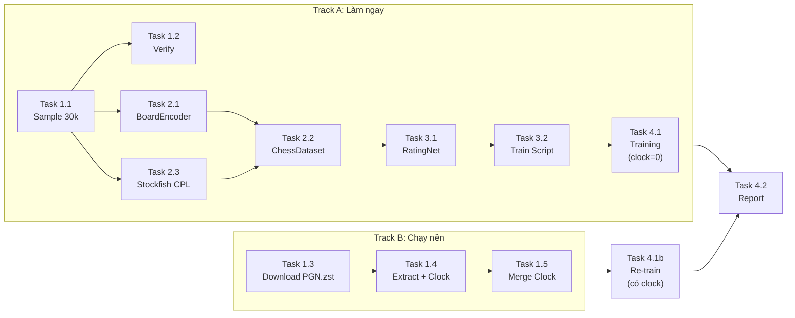

# DL Rating Net — Kế hoạch triển khai

## Milestones

- [ ] **M1:** Data Pipeline hoàn thành — có `sample_30k_v2.parquet` với clock time
- [ ] **M2:** Data Processing — ChessDataset + BoardEncoder hoạt động, tạo được Tensor
- [ ] **M3:** Model Training — RatingNet train được trên 30k, loss convergence
- [ ] **M4:** Evaluation — Báo cáo MAE, so sánh với V2/V3

## Task Breakdown

### Phase 1: Data Pipeline (Ưu tiên cao nhất)

> **Thực trạng:**
> - 2 file parquet lớn (~23GB mỗi file, ~187M ván) **KHÔNG CÓ clock time** (`%clk` bị strip bởi `preprocessing.py` dòng 224: `variation_san()`).
> - File PGN.zst gốc **ĐÃ BỊ XÓA** khỏi máy.
> - Cần download lại PGN.zst (~30GB) để re-extract clock.

#### Track A: Làm ngay (không cần clock)

- [ ] **Task 1.1:** Viết `src/data/create_30k_sample_v2.py`
  - Clone logic từ `create_30k_sample.py`
  - Bỏ `EXCLUDED_FORMATS` và `EXCLUDED_TERMINATIONS` (giữ tất cả thể thức + time forfeit)
  - Thêm `TimeControl`, `Result` vào `KEEP_COLUMNS`
  - Giữ 6k/band × 5 = 30k ván
  - Output: `data/processed/sample_30k_v2.parquet`
  - **Thời gian:** 30 phút

- [ ] **Task 1.2:** Verify data
  - Kiểm tra phân bổ ELO (histogram 5 bands)
  - Kiểm tra phân bổ thể thức (Bullet/Blitz/Rapid/Classical)
  - Thống kê số nước đi
  - **Thời gian:** 15 phút

#### Track B: Chạy nền (lấy clock time)

- [ ] **Task 1.3:** Download PGN.zst từ Lichess
  - URL: `https://database.lichess.org/standard/lichess_db_standard_rated_2025-12.pgn.zst`
  - Dung lượng: ~30GB
  - Lưu: `data/raw/lichess_db_standard_rated_2025-12.pgn.zst`
  - **Thời gian:** 1-2 giờ (download nền)

- [ ] **Task 1.4:** Viết `src/data/extract_with_clocks.py`
  - Stream PGN.zst → reservoir sampling 30k ván (6k/band)
  - Parse `%clk` từ PGN comment (`node.comment`)
  - Giữ cả SAN moves + clock sequence
  - Dừng sớm khi đủ 30k (chỉ cần đọc ~1% file, ~15 phút)
  - Output: `data/processed/sample_30k_with_clocks.parquet`
  - **Thời gian:** 1 giờ code + 15 phút chạy

- [ ] **Task 1.5:** Merge clock vào dataset
  - Cập nhật `ChessDataset` để load clock từ file mới
  - Re-train model với clock input
  - **Thời gian:** 30 phút

### Phase 2: Data Processing

- [ ] **Task 2.1:** Viết `src/data/board_encoder.py`
  - Hàm encode bàn cờ → tensor 12×8×8
  - Hàm replay ván cờ SAN → danh sách board states
  - **Thời gian:** 1 giờ

- [ ] **Task 2.2:** Viết `src/data/chess_dataset.py`
  - PyTorch Dataset class
  - Load parquet → replay → encode → padding
  - Collate function cho DataLoader
  - **Thời gian:** 2 giờ

- [ ] **Task 2.3:** Chạy Stockfish CPL extraction cho 30k ván
  - Tận dụng lại logic từ `src/features/extract_sequences.py`
  - Output: cpl_seq + blunder_seq cho mỗi ván
  - **Thời gian:** 30-60 phút (đã có code)

### Phase 3: Model

- [ ] **Task 3.1:** Port `ChessEloPredictor` thành `src/models/rating_net.py`
  - Copy kiến trúc CNN + LSTM từ paperbaseline.py
  - Mở rộng input_size = conv_out + 1(clock) + 1(cpl) + 1(blunder)
  - **Thời gian:** 1 giờ

- [ ] **Task 3.2:** Viết `src/models/train.py`
  - Training loop + validation
  - Checkpoint + TensorBoard
  - Config bằng dict (giống paper)
  - **Thời gian:** 1.5 giờ

### Phase 4: Evaluation

- [ ] **Task 4.1:** Train trên 30k sample
  - batch_size=32, epochs=60, lr=1e-4
  - **Thời gian:** 1-2 giờ (GPU dependent)

- [ ] **Task 4.2:** Đánh giá + Báo cáo
  - MAE tổng, MAE theo thể thức
  - Ablation: có/không CPL/Blunder
  - So sánh bảng V1/V2/V3/V4(DL)
  - **Thời gian:** 1 giờ

## Dependencies

## Timeline & Estimates

| Phase | Track A (ngay) | Track B (nền) |
|---|---|---|
| Phase 1: Data Pipeline | 45 phút (sample + verify) | 2-3 giờ (download + extract) |
| Phase 2: Data Processing | 3-4 giờ | — |
| Phase 3: Model | 2.5 giờ | — |
| Phase 4: Evaluation | 2-3 giờ | +30 phút re-train với clock |

## Risks & Mitigation

| Risk | Impact | Mitigation |
|---|---|---|
| ~~PGN.zst không có trên máy~~ | ~~Không lấy được clock time~~ | **ĐÃ XẢY RA:** PGN.zst đã bị xóa. Cần download lại (~30GB). Train trước không clock. |
| GPU không đủ VRAM | Không train được batch_size=32 | Giảm batch_size, giảm max_moves |
| Stockfish CPL chạy quá lâu | Delay Phase 2 | Giảm depth=8, hoặc dùng tập nhỏ hơn |
| MAE không cải thiện so với V3 | Kết quả không đạt mục tiêu | Tăng data, tune hyperparameters |

## Resources Needed

- **Hardware:** GPU >= 6GB VRAM (hoặc Colab)
- **Software:** PyTorch, Stockfish v16+, python-chess
- **Data:** 2 file parquet lớn + PGN.zst (cho clock)
- **Thời gian:** ~2-3 sessions làm việc
