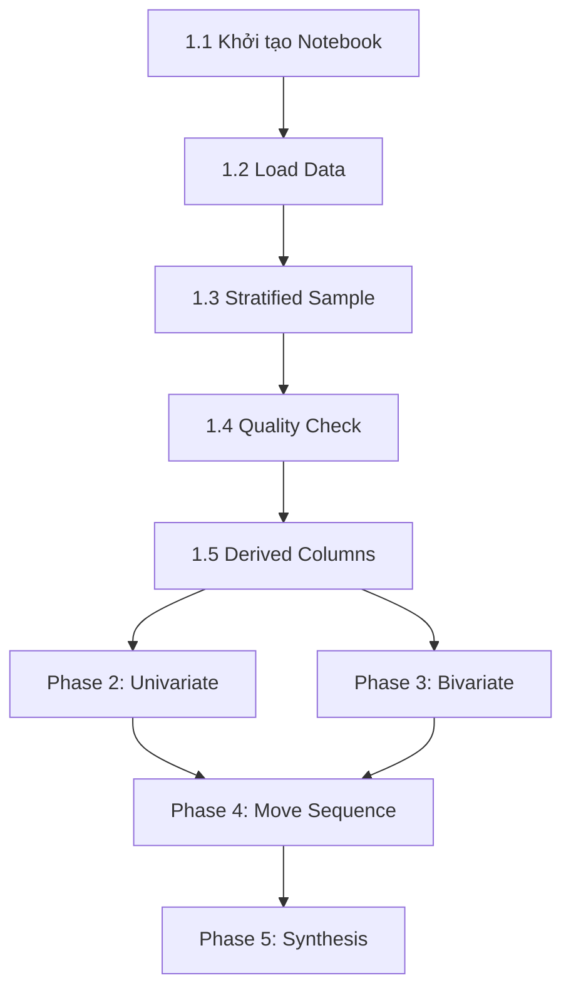

# Project Planning & Task Breakdown — EDA cho Dự đoán ELO Realtime

## Milestones
**Các mốc kiểm tra chính**

- [x] **Milestone 1**: Data Loading & Quality Check — Notebook tạo xong, data load thành công, quality report hoàn thành
- [x] **Milestone 2**: Univariate Analysis — Tất cả phân tích đơn biến hoàn thành với biểu đồ + insight
- [x] **Milestone 3**: Bivariate & Multivariate Analysis — Phân tích đa biến ECO×ELO, correlation matrix hoàn thành
- [x] **Milestone 4**: Move Sequence Analysis — Phân tích first-N-moves, n-gram, opening diversity hoàn thành
- [x] **Milestone 5**: Feasibility Report — Tổng hợp insights, trả lời 3 câu hỏi chiến lược, feature ranking

## Task Breakdown
**Công việc cụ thể cần thực hiện**

### Phase 1: Setup & Data Loading (Milestone 1)
- [x] **Task 1.1**: Khởi tạo `eda/EDA_Notebook.ipynb` với cấu trúc sections rõ ràng
- [x] **Task 1.2**: Import libraries, load 2 file Parquet bằng Polars LazyFrame
- [x] **Task 1.3**: Tạo stratified sample (2-5M rows tổng) — sample đại diện theo ELO band & GameFormat
- [x] **Task 1.4**: Data quality check: null counts, describe(), value_counts() cho categoricals
- [x] **Task 1.5**: Tính derived columns (EloDiff, EloBand, EcoCategory)
- [x] **Task 1.6**: Kiểm tra chất lượng cột Moves: tỷ lệ null/empty, avg token count, format validation (SAN)

### Phase 2: Univariate Analysis (Milestone 2)
- [x] **Task 2.1**: ELO Distribution — Histogram + KDE cho WhiteElo, BlackElo, EloAvg
- [x] **Task 2.2**: ELO Distribution theo GameFormat — Faceted histograms
- [x] **Task 2.3**: ELO Box Plot phát hiện outliers — IQR method
- [x] **Task 2.4**: Top 20 ECO codes — Horizontal bar chart
- [x] **Task 2.5**: NumMoves distribution — Histogram + statistics
- [x] **Task 2.6**: GameFormat & Termination distribution — Pie/bar charts
- [x] **Task 2.7**: Result distribution (Win/Draw/Loss) — Bar chart + imbalance ratio
- [x] **Task 2.8**: Viết Markdown insights cho mỗi biểu đồ univariate

### Phase 3: Bivariate & Multivariate Analysis (Milestone 3)
- [x] **Task 3.1**: ECO Category (A-E) × ELO Band — Normalized heatmap
- [x] **Task 3.2**: Top ECO codes ở Low ELO vs High ELO — Comparative bar chart
- [x] **Task 3.3**: EloAvg distribution per top ECO — Grouped box plot
- [x] **Task 3.4**: EloDiff × Win Rate — Scatter/line plot
- [x] **Task 3.5**: Opening × White Win Rate — Bar chart top 15 openings
- [x] **Task 3.6**: Correlation matrix — Heatmap cho numeric features
- [x] **Task 3.7**: GameFormat × Mean ELO — Grouped bar chart
- [x] **Task 3.8**: Viết Markdown insights cho phân tích đa biến

### Phase 4: Move Sequence Analysis (Milestone 4)
- [x] **Task 4.1**: Extract first-5, first-10, first-15 moves từ cột Moves (sample 500K-1M ván)
- [x] **Task 4.2**: First move distribution (e4/d4/c4/Nf3/...) × ELO Band — Stacked bar
- [x] **Task 4.3**: Move bigram/trigram frequency × ELO Band — Top N per band
- [x] **Task 4.4**: Opening diversity (unique ECO count) per ELO Band — Bar chart
- [x] **Task 4.5**: Discriminative power assessment — "Sau N nước, phân biệt ELO band tốt cỡ nào?"
- [x] **Task 4.6**: Viết Markdown insights cho move analysis

### Phase 5: Synthesis & Feasibility Report (Milestone 5)
- [x] **Task 5.1**: Class Imbalance Analysis — ELO band distribution + imbalance ratio
- [x] **Task 5.2**: Temporal Stability — So sánh Dec 2025 vs Jan 2026
- [x] **Task 5.3**: Feature Importance Ranking — XGBoost GPU (RTX 3060) trên sample 1-3M rows, fallback DecisionTree CPU
- [x] **Task 5.4**: Trả lời Q1: First-N-moves feasibility assessment
- [x] **Task 5.5**: Trả lời Q2: ELO band design recommendation
- [x] **Task 5.6**: Trả lời Q3: Feature engineering roadmap
- [x] **Task 5.7**: Viết Executive Summary — Key findings + next steps
- [x] **Task 5.8**: Export biểu đồ quan trọng ra `eda/outputs/`

## Dependencies
**Thứ tự thực hiện**

### Module (Design) → Task (Planning) Mapping
| Design Module | Planning Tasks | Milestone |
|---------------|---------------|----------|
| Module 1: Data Quality & Overview | Task 1.2-1.6 | M1 |
| Module 2: Univariate ELO | Task 2.1-2.3 | M2 |
| Module 3: Univariate Opening & Game | Task 2.4-2.7 | M2 |
| Module 4: Bivariate ECO×ELO | Task 3.1-3.3 | M3 |
| Module 5: Bivariate EloDiff×Result | Task 3.4-3.5 | M3 |
| Module 6: Move Sequence Analysis | Task 4.1-4.5 | M4 |
| Module 7: Multivariate Correlation | Task 3.6-3.7, 5.3 | M3/M5 |
| Module 8: Class Imbalance & Sampling | Task 5.1-5.2 | M5 |
| Module 9: Feasibility Assessment | Task 5.4-5.7 | M5 |

- **Phase 2 & 3** có thể chạy **song song** sau Phase 1 hoàn thành
- **Phase 4** phụ thuộc vào Phase 2 (cần ELO bands) và Phase 3 (cần hiểu ECO patterns)
- **Phase 5** phụ thuộc tất cả phases trước

### External Dependencies
- Polars, Matplotlib, Seaborn đã cài trong conda environment `MMDS`
- python-chess cần kiểm tra (cho move parsing ở Phase 4)
- Data Parquet files đã sẵn sàng tại `data/processed/`

## Timeline & Estimates
**Ước tính thời gian**

| Phase | Công việc                    | Effort    | Ghi chú                                    |
|-------|------------------------------|-----------|---------------------------------------------|
| 1     | Setup & Data Loading         | 30-45 phút | Boilerplate + sampling + GPU check          |
| 2     | Univariate Analysis          | 1-1.5 giờ | 7+ biểu đồ + markdown insight               |
| 3     | Bivariate & Multivariate     | 1.5-2 giờ  | Phần quan trọng nhất, nhiều analysis         |
| 4     | Move Sequence Analysis       | 1-1.5 giờ  | Parse moves — tối ưu bằng vectorized ops    |
| 5     | Synthesis & Report           | 1-1.5 giờ  | Tổng hợp + XGBoost GPU feature importance    |
| **Tổng** |                           | **5-7 giờ** | Nhanh hơn nhờ GPU + 20-thread CPU           |

## Risks & Mitigation
**Rủi ro và cách giảm thiểu**

| Rủi ro | Mức độ | Giảm thiểu |
|--------|--------|-------------|
| OOM khi load data lớn | Cao | Dùng Polars LazyFrame + sampling. Không collect() toàn bộ |
| Move parsing quá chậm | Trung bình | Sample nhỏ hơn (500K thay vì 5M). Dùng string split thay python-chess nếu cần |
| XGBoost GPU không chạy được | Thấp | Fallback về DecisionTree/RandomForest CPU. Cài xgboost GPU: `pip install xgboost` (cần CUDA toolkit) |
| Biểu đồ quá đông dữ liệu | Thấp | Aggregation trước khi plot. Dùng heatmap thay scatter cho lớn |
| ECO code quá nhiều categories | Trung bình | Group về 5 categories (A-E) hoặc top-N |
| Insight không actionable | Thấp | Mỗi biểu đồ bắt buộc kèm "So what?" + "Implication for model" |

## Resources Needed
**Tài nguyên cần thiết**

### Libraries (đã có trong conda env)
- `polars` >= 1.0 — Data loading & wrangling
- `matplotlib` >= 3.7 — Core visualization
- `seaborn` >= 0.12 — Statistical visualization
- `numpy` — Numerical computation

### Libraries cần kiểm tra/cài thêm
- `python-chess` — Parse SAN move strings (Phase 4)
- `scipy` — Statistical tests (nếu cần)
- `sklearn` — Baseline feature importance (Phase 5)
- `xgboost` — GPU-accelerated feature importance (Phase 5, cần CUDA)
- `torch` (optional) — Nếu thử move embedding approach

### Infrastructure
- Jupyter Notebook runtime (VS Code Jupyter extension hoặc JupyterLab)
- **CPU**: i5-14600KF — 20 threads
- **GPU**: RTX 3060 12GB VRAM — CUDA 12.x, driver 590.48
- **RAM**: 31 GB (24 GB available)
- Disk: ~45 GB cho data + ~100 MB cho outputs

---

## Kết quả Thực tế (Post-Execution)
**Ghi nhận sau khi notebook chạy xong**

### Metrics
| Chỉ số | Mục tiêu | Thực tế |
|--------|---------|---------|
| Charts xuất | 8–10 | **17 charts** ✅ |
| Dataset size | ~187M rows | **187,320,359 ván** ✅ |
| Sample size | 3M rows | **3,000,000 rows (stratified)** ✅ |
| XGBoost training time | < 60s | **11.3s** ✅ |
| XGBoost acc (5-class) | baseline | **44.18%** (~2.2× random) ✅ |
| Feature engine | GPU | **XGBoost GPU (RTX 3060)** ✅ |

### Key Findings
1. **ECO Code** là feature quan trọng nhất (EcoCategory_C: 16.5%, EcoCategory_E: 8.5%)
2. **BaseTime** surprising: feature #1 (27.9%) — proxy gián tiếp qua GameFormat
3. **5-class accuracy 44.18%** với chỉ tabular features → cần sequence features cho model tốt hơn
4. **Class imbalance**: phân phối khá đều sau stratified sampling; trên full dataset bands cực lệch
5. **First 10 moves**: đủ signal cho 5-class discrimination, first 3 moves too weak

### Issues Phát hiện & Đã Fix
- `cut()` API Polars: `breaks[1:]` → `breaks[1:-1]` (7 locations)
- `streaming=True` → `engine="streaming"` (3 locations)
- `replace(dict, default=)` → `replace_strict(keys, values, default=)` (cell 37)
- `boxplot(labels=)` → `boxplot(tick_labels=)` (Matplotlib 3.9+ deprecation)
- XGBoost UserWarning DMatrix → filtered in warnings config
- Import scope bug in cell 35 (accuracy_score before try block)

### Next Phase Recommendation
→ **Feature Engineering** (`feature-engineering-elo-prediction`):
- Move sequence encoding: hash-based N-gram, TF-IDF trên opening tokens
- Opening diversity index per game (Shannon entropy của move distribution)
- ECO embedding (trainable hoặc one-hot cho top-50 ECO)
- Target: tabular + sequence combined features → XGBoost/LightGBM → LSTM/Transformer ensemble
