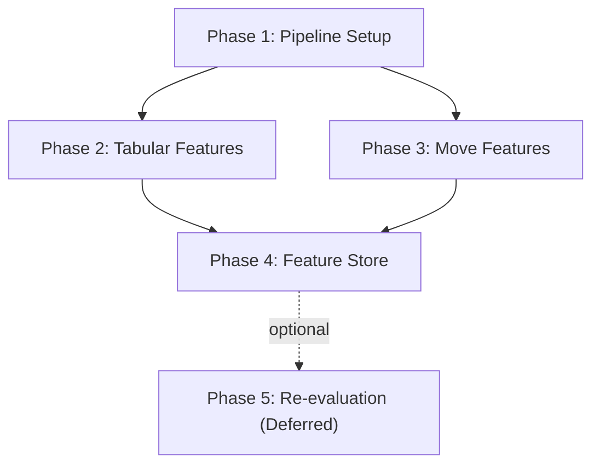

## Planning — Feature Engineering cho Dự đoán ELO Realtime

## Milestones

- [x] **Milestone 1**: Feature Pipeline Setup — Cấu trúc module, config, data loading OK
- [x] **Milestone 2**: Tabular Features — ECO, GameFormat, BaseTime, NumMoves features OK
- [x] **Milestone 3**: Move Sequence Features — First-N-moves tokenization, N-gram TF-IDF OK
- [x] **Milestone 4**: Feature Store — Train/val split, save Parquet features OK
- [ ] **Milestone 5**: Baseline Re-evaluation — **Deferred (ngoài phạm vi FE-only hiện tại)**

## Task Breakdown

### Phase 1: Feature Pipeline Setup

- [x] **Task 1.1**: Tạo `src/feature_engineering.py` với FeaturePipeline class _(Done: đã có FeaturePipeline + loader/transformer skeleton)_
- [x] **Task 1.2**: Config: feature selection flags, N*MOVES, ECO_TOP_N, TF-IDF vocab size *(Done: tách vào `src/feature_config.py`)\_
- [x] **Task 1.3**: Data loading từ Parquet với projection (chỉ đọc columns cần thiết) _(Done: `projection_columns()` + `iter_input_batches()`)_
- [x] **Task 1.4**: Target encoding: `ModelBand` từ `EloAvg` theo MODEL*BINS *(Done: `ensure_target_column()` + bins map)\_

### Phase 2: Tabular Features

- [x] **Task 2.1**: ECO top-N one-hot (N=100, 200) — Polars `to_dummies` + column selection _(Done: one-hot ổn định theo vocab đã fit)_
- [x] **Task 2.2**: EcoCategory one-hot (A-E) — `ECO.str.slice(0,1).to_dummies()` _(Done: luôn sinh đủ eco_cat_A..E)_
- [x] **Task 2.3**: GameFormat one-hot — handle "Unknown" category _(Done: ép Unknown vào vocab và schema output)_
- [x] **Task 2.4**: BaseTime, Increment log-transform — `log1p()`, clip outliers _(Done: clip theo quantile 99% + log1p)_
- [x] **Task 2.5**: NumMoves clip (cap tại 100) + normalize _(Done: clip 0..100 rồi chuẩn hóa)_
- [x] **Task 2.6**: EloDiff chỉ dùng nếu training mode (không phải realtime inference) _(Done: chỉ xuất elo_diff_norm khi realtime_mode=False)_
- [x] **Task 2.7**: Viết unit tests cho từng transformer _(Done: tests/test_tabular_transformer.py, 4 tests pass)_

### Phase 3: Move Sequence Features

- [x] **Task 3.1**: Move tokenizer: strip move numbers, result strings → clean token list _(Done: `_clean_moves_text()` + `_tokenize()`)_
- [x] **Task 3.2**: First-N-ply extractor (N=5, 10, 15) — vectorized `str.split().list.head(N)` _(Done: `_tokenize(..., n_ply=...)`)_
- [x] **Task 3.3**: First move one-hot (e4/d4/c4/Nf3/other → 5d) _(Done: `_first_move_group()`)_
- [x] **Task 3.4**: Move bigram extractor — sliding window trên token list _(Done: `_bigrams()` + fit bigram vocab)_
- [x] **Task 3.5**: TF-IDF fitting trên sample 500K games → save vocabulary _(Done: `TfidfVectorizer` bigram + max_features=200)_
- [x] **Task 3.6**: TF-IDF transform + SVD 50d (LSA) — sklearn pipeline _(Done: `TruncatedSVD` + pad/truncate về `svd_dim`)_
- [x] **Task 3.7**: Opening entropy: -Σ p*i \* log(p_i) của unigram distribution per game *(Done: `_entropy()` theo Shannon entropy)\_
- [x] **Task 3.8**: Viết unit tests cho move features _(Done: `tests/test_move_transformer.py`, pass)_
- [x] **Task 3.9**: Tích hợp `python-chess` để parse SAN và trích xuất board-state features ổn định (check, castling, pawn move) _(Done: `_board_state_features()` dùng python-chess)_

### Phase 4: Feature Store

- [x] **Task 4.1**: Temporal split: Dec 2025 → train (93.9M), Jan 2026 → val (93.4M) _(Done: `temporal_split_files()`)_
- [x] **Task 4.2**: Batch processing (10M rows/batch) → tránh OOM _(Done: `process_split_to_parquet()` theo batch + part files)_
- [x] **Task 4.2a**: Loại bỏ bản ghi `<5 ply` và log drop rate theo từng split _(Done: `apply_data_quality_gate()`)_
- [x] **Task 4.2b**: Gate chất lượng dữ liệu: pass <=1.5%, warning (1.5%, 3%], fail >3% _(Done: pass/warn/fail thresholds)_
- [x] **Task 4.3**: Save feature matrix: `data/features/train_features.parquet` _(Done: output split parquet)_
- [x] **Task 4.4**: Save feature matrix: `data/features/val_features.parquet` _(Done: output split parquet)_
- [x] **Task 4.5**: Save feature metadata: column names, vocab, SVD components _(Done: `save_metadata()`)_
- [x] **Task 4.6**: Verify: row counts, null counts, schema consistency _(Done: `verify_schema_consistency()` + stats)_
- [x] **Task 4.7**: Lock random seed + version hóa artifacts để so sánh công bằng giữa các vòng tối ưu _(Done: seed lock trong `FeaturePipeline.__init__`)_

### Phase 5: Baseline Re-evaluation (Deferred)

- [ ] **Task 5.1**: Load train features -> XGBoost GPU (để Model Training phase xử lý)
- [ ] **Task 5.2**: Evaluate trên val set: accuracy, macro F1, per-class breakdown
- [ ] **Task 5.3**: Feature importance plot với new features
- [ ] **Task 5.4**: Ablation: tabular-only vs tabular+sequence vs all features
- [ ] **Task 5.5**: So sánh với EDA baseline (44.18%)
- [ ] **Task 5.6**: Nếu acc <60%, tối ưu theo thứ tự move sequence -> ECO -> metadata
- [ ] **Task 5.7**: Document findings và next steps cho Model Training phase

## Dependencies



- Phase 2 và 3 có thể **chạy song song** sau Phase 1
- Phase 4 cần cả Phase 2 AND Phase 3 hoàn thành
- Phase 5 hiện được tách sang **Model Training phase**, không phải điều kiện hoàn tất FE-only

## Timeline & Estimates

| Phase    | Công việc        | Effort      | Ghi chú                            |
| -------- | ---------------- | ----------- | ---------------------------------- |
| 1        | Pipeline Setup   | 1-1.5 giờ   | Module structure + config          |
| 2        | Tabular Features | 1-1.5 giờ   | ECO, GameFormat, numeric           |
| 3        | Move Features    | 2-3 giờ     | Tokenizer, TF-IDF, entropy         |
| 4        | Feature Store    | 1-2 giờ     | Batch processing 187M rows         |
| 5        | Re-evaluation    | 1 giờ       | Deferred sang Model Training phase |
| **Tổng** |                  | **6-9 giờ** |                                    |

## Risks & Mitigation

| Rủi ro                       | Mức độ     | Giảm thiểu                                                                      |
| ---------------------------- | ---------- | ------------------------------------------------------------------------------- |
| TF-IDF vocabulary quá lớn    | Trung bình | Limit top-N bigrams (200), SVD 50d → manageable                                 |
| Feature store quá lớn (disk) | Thấp       | Float32 thay Float64, chỉ save top features                                     |
| Feature leakage              | Cao        | Review list: không dùng WhiteElo/BlackElo/EloAvg/RatingDiff làm input           |
| Move parsing edge cases      | Thấp       | Unit tests với SAN edge cases (castling, promotion, en passant)                 |
| Batch processing OOM         | Trung bình | 10M rows/batch, monitor với tracemalloc                                         |
| Drop rate `<5 ply` cao       | Trung bình | Theo dõi theo split, phân tích bias theo `GameFormat`/`ModelBand`, fail nếu >3% |
| Parser SAN sai lệch          | Trung bình | Dùng `python-chess` làm parser chuẩn + test chéo với parser chuỗi hiện tại      |

## Output Files

```text
src/
├── feature_engineering.py      # FeaturePipeline class
├── feature_config.py           # Constants: N_MOVES, ECO_TOP_N, etc.
data/features/
├── train_features.parquet      # Dec 2025 features (~93.9M rows)
├── val_features.parquet        # Jan 2026 features (~93.4M rows)
├── tfidf_vocabulary.pkl        # TF-IDF vocab
├── svd_components.pkl          # LSA SVD components
└── feature_columns.json        # Column names list
notebooks/
└── Feature_Engineering_EDA.ipynb  # Validation notebook (optional)
```

## New Work

- [x] Tích hợp thư viện `python-chess` vào pipeline FE cho parsing SAN và board-state features theo yêu cầu PM
- [x] Xem xét tạo cấu trúc thư mục `notebooks/` theo nhóm mục tiêu (exploration, feature-test, experiment-log) cho test/thử nghiệm dài hạn _(Done: tạo `notebooks/feature-engineering/` và các thư mục con)_
- [x] Rule mới: ưu tiên notebook cho test/thử nghiệm, terminal chủ yếu cho automation/full batch
- [ ] Iteration tối ưu #2 (move-first): n_ply=15, TF-IDF 1-2gram (max_features=500), thêm move meta features (`unique_move_ratio`, `capture_ratio`, `check_symbol_ratio`) — **Deferred trong FE-only, chuyển sang Model Training phase**

## Acceptance Criteria (Definition of Done)

- [ ] **Code quality**: `feature_engineering.py` có docstrings tiếng Việt, type hints
- [ ] **Tests**: Unit tests cho tokenizer, TF-IDF, entropy calculation
- [ ] **No leakage**: Đã verify danh sách features không chứa target-proxy
- [ ] **Performance**: Pipeline chạy trên 187M rows < 4 giờ
- [ ] **Data quality gate**: drop rate do `<5 ply` đạt pass <=1.5%; >3% là fail
- [ ] **Feature artifacts**: Sinh đủ train/val features + metadata artifacts với schema nhất quán
- [ ] **Documentation**: Cập nhật planning doc và FE report khi chốt vòng FE-only
