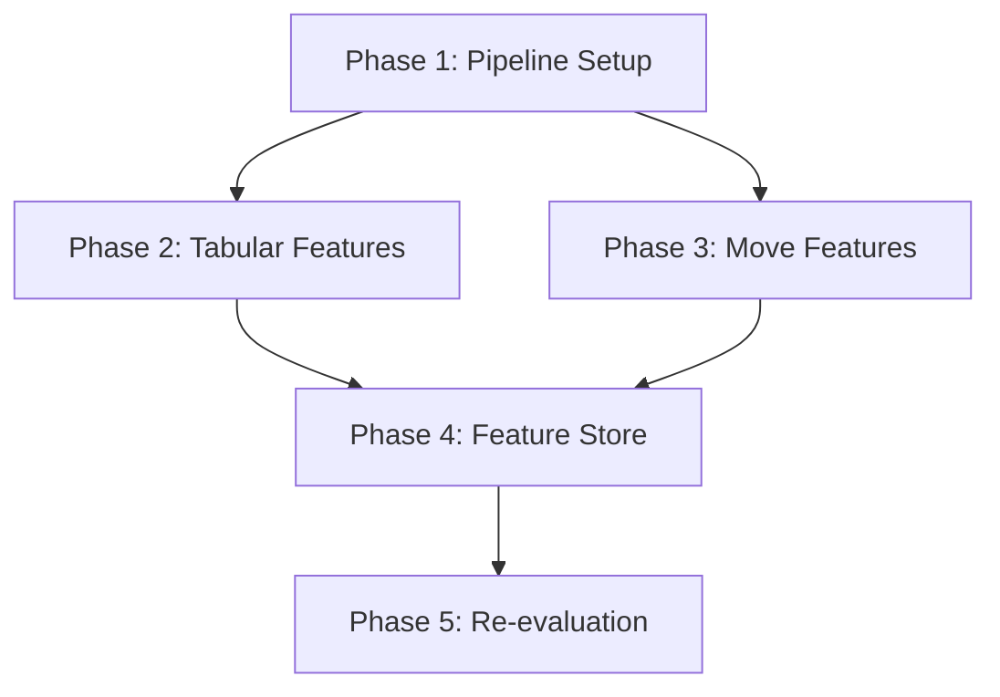

# Planning — Feature Engineering cho Dự đoán ELO Realtime

## Milestones
- [ ] **Milestone 1**: Feature Pipeline Setup — Cấu trúc module, config, data loading OK
- [ ] **Milestone 2**: Tabular Features — ECO, GameFormat, BaseTime, NumMoves features OK
- [ ] **Milestone 3**: Move Sequence Features — First-N-moves tokenization, N-gram TF-IDF OK
- [ ] **Milestone 4**: Feature Store — Train/val split, save Parquet features OK
- [ ] **Milestone 5**: Baseline Re-evaluation — XGBoost với new features, acc ≥ 55%

## Task Breakdown

### Phase 1: Feature Pipeline Setup
- [ ] **Task 1.1**: Tạo `src/feature_engineering.py` với FeaturePipeline class
- [ ] **Task 1.2**: Config: feature selection flags, N_MOVES, ECO_TOP_N, TF-IDF vocab size
- [ ] **Task 1.3**: Data loading từ Parquet với projection (chỉ đọc columns cần thiết)
- [ ] **Task 1.4**: Target encoding: `ModelBand` từ `EloAvg` theo MODEL_BINS

### Phase 2: Tabular Features
- [ ] **Task 2.1**: ECO top-N one-hot (N=100, 200) — Polars `to_dummies` + column selection
- [ ] **Task 2.2**: EcoCategory one-hot (A-E) — `ECO.str.slice(0,1).to_dummies()`
- [ ] **Task 2.3**: GameFormat one-hot — handle "Unknown" category
- [ ] **Task 2.4**: BaseTime, Increment log-transform — `log1p()`, clip outliers
- [ ] **Task 2.5**: NumMoves clip (cap tại 100) + normalize
- [ ] **Task 2.6**: EloDiff chỉ dùng nếu training mode (không phải realtime inference)
- [ ] **Task 2.7**: Viết unit tests cho từng transformer

### Phase 3: Move Sequence Features
- [ ] **Task 3.1**: Move tokenizer: strip move numbers, result strings → clean token list
- [ ] **Task 3.2**: First-N-ply extractor (N=5, 10, 15) — vectorized `str.split().list.head(N)`
- [ ] **Task 3.3**: First move one-hot (e4/d4/c4/Nf3/other → 5d)
- [ ] **Task 3.4**: Move bigram extractor — sliding window trên token list
- [ ] **Task 3.5**: TF-IDF fitting trên sample 500K games → save vocabulary
- [ ] **Task 3.6**: TF-IDF transform + SVD 50d (LSA) — sklearn pipeline
- [ ] **Task 3.7**: Opening entropy: -Σ p_i * log(p_i) của unigram distribution per game
- [ ] **Task 3.8**: Viết unit tests cho move features

### Phase 4: Feature Store
- [ ] **Task 4.1**: Temporal split: Dec 2025 → train (93.9M), Jan 2026 → val (93.4M)
- [ ] **Task 4.2**: Batch processing (10M rows/batch) → tránh OOM
- [ ] **Task 4.3**: Save feature matrix: `data/features/train_features.parquet`
- [ ] **Task 4.4**: Save feature matrix: `data/features/val_features.parquet`
- [ ] **Task 4.5**: Save feature metadata: column names, vocab, SVD components
- [ ] **Task 4.6**: Verify: row counts, null counts, schema consistency

### Phase 5: Baseline Re-evaluation
- [ ] **Task 5.1**: Load train features → XGBoost GPU (n_estimators=500, max_depth=8)
- [ ] **Task 5.2**: Evaluate trên val set: accuracy, macro F1, per-class breakdown
- [ ] **Task 5.3**: Feature importance plot với new features
- [ ] **Task 5.4**: Ablation: tabular-only vs tabular+sequence vs all features
- [ ] **Task 5.5**: So sánh với EDA baseline (44.18%) → ghi nhận improvement
- [ ] **Task 5.6**: Document findings và next steps cho Model Training phase

## Dependencies



- Phase 2 và 3 có thể **chạy song song** sau Phase 1
- Phase 4 cần cả Phase 2 AND Phase 3 hoàn thành
- Phase 5 cần Phase 4 hoàn thành

## Timeline & Estimates

| Phase | Công việc | Effort | Ghi chú |
|-------|-----------|--------|---------|
| 1 | Pipeline Setup | 1-1.5 giờ | Module structure + config |
| 2 | Tabular Features | 1-1.5 giờ | ECO, GameFormat, numeric |
| 3 | Move Features | 2-3 giờ | Tokenizer, TF-IDF, entropy |
| 4 | Feature Store | 1-2 giờ | Batch processing 187M rows |
| 5 | Re-evaluation | 1 giờ | XGBoost run + analysis |
| **Tổng** | | **6-9 giờ** | |

## Risks & Mitigation

| Rủi ro | Mức độ | Giảm thiểu |
|--------|--------|------------|
| TF-IDF vocabulary quá lớn | Trung bình | Limit top-N bigrams (200), SVD 50d → manageable |
| Feature store quá lớn (disk) | Thấp | Float32 thay Float64, chỉ save top features |
| Feature leakage | Cao | Review list: không dùng WhiteElo/BlackElo/EloAvg/RatingDiff làm input |
| Move parsing edge cases | Thấp | Unit tests với SAN edge cases (castling, promotion, en passant) |
| Batch processing OOM | Trung bình | 10M rows/batch, monitor với tracemalloc |

## Output Files
```
src/
├── feature_engineering.py      # FeaturePipeline class
├── feature_config.py           # Constants: N_MOVES, ECO_TOP_N, etc.
data/features/
├── train_features.parquet      # Dec 2025 features (~93.9M rows)
├── val_features.parquet        # Jan 2026 features (~93.4M rows)  
├── tfidf_vocabulary.pkl        # TF-IDF vocab
├── svd_components.pkl          # LSA SVD components
└── feature_columns.json        # Column names list
notebooks/
└── Feature_Engineering_EDA.ipynb  # Validation notebook (optional)
```

## Acceptance Criteria (Definition of Done)
- [x] **Code quality**: `feature_engineering.py` có docstrings tiếng Việt, type hints
- [x] **Tests**: Unit tests cho tokenizer, TF-IDF, entropy calculation
- [x] **No leakage**: Đã verify danh sách features không chứa target-proxy
- [x] **Performance**: Pipeline chạy trên 187M rows < 4 giờ  
- [x] **Improvement**: XGBoost acc ≥ 55% (từ 44.18% baseline)
- [x] **Documentation**: Cập nhật planning doc sau khi hoàn thành
