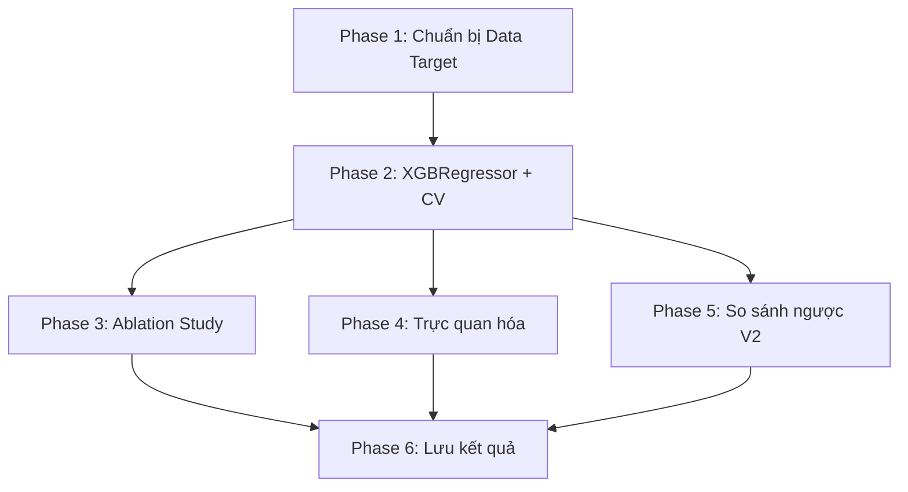

# Planning V3 — Regression ELO Prediction

## Milestones

- [ ] **Milestone 1**: Chuẩn bị data target — join EloAvg vào features V2
- [ ] **Milestone 2**: Xây dựng XGBRegressor + 5-Fold CV
- [ ] **Milestone 3**: Ablation Study (4 configs) — chứng minh giá trị features
- [ ] **Milestone 4**: Trực quan hóa 4 biểu đồ + so sánh ngược V2
- [ ] **Milestone 5**: Lưu kết quả + Báo cáo tổng hợp

## Task Breakdown

### Phase 1: Chuẩn bị dữ liệu Target (15 phút)

- [ ] **Task 1.1**: Load `data/features/sample_30k_features_v2.parquet` → tách X features (bỏ `ModelBand`)
- [ ] **Task 1.2**: Load `data/processed/sample_30k.parquet` → lấy cột `EloAvg` làm target y
- [ ] **Task 1.3**: Join X và y theo index — verify shape khớp (30k rows)
- [ ] **Task 1.4**: Kiểm tra phân phối EloAvg: `mean ≈ 1650`, `std ≈ 400`, range `[400, 3700+]`
- [ ] **Task 1.5**: Verify không có NaN/Inf trong target y

### Phase 2: Xây Model XGBRegressor (30 phút)

- [ ] **Task 2.1**: Tạo file `src/eval_xgboost_v3.py` — skeleton cơ bản
- [ ] **Task 2.2**: Cấu hình XGBRegressor params:
  ```python
  XGB_REG_PARAMS = {
      "objective": "reg:squarederror",
      "eval_metric": "mae",
      "max_depth": 6,
      "learning_rate": 0.1,
      "n_estimators": 300,
      "random_state": 42,
      "n_jobs": -1,
  }
  ```
- [ ] **Task 2.3**: Implement KFold 5-Fold Cross-Validation (shuffle=True, random_state=42)
- [ ] **Task 2.4**: Tính metrics mỗi fold: MAE, RMSE, R²
- [ ] **Task 2.5**: In kết quả trung bình ± std cho từng metric
- [ ] **Task 2.6**: Chạy thử và xác nhận hoạt động đúng

### Phase 3: Ablation Study (20 phút)

- [ ] **Task 3.1**: Định nghĩa 4 feature configs (giống V2):
  - Config A: Tabular Only → chỉ ECO + NumMoves
  - Config B: Tabular + Nhóm A (avg_cpl, cpl_std, blunder/mistake/inaccuracy_rate)
  - Config C: Tabular + A + B (+ opening/midgame/endgame_cpl)
  - Config D: Full V2 (A + B + C: + avg_wdl_loss, max_wdl_loss, best_move_match_rate)
- [ ] **Task 3.2**: Chạy 5-Fold CV cho mỗi config → ghi nhận MAE, RMSE, R²
- [ ] **Task 3.3**: In bảng so sánh Ablation để chứng minh từng nhóm features đóng góp

### Phase 4: Trực quan hóa (30 phút)

- [ ] **Task 4.1**: Tạo thư mục `data/results/v3/`
- [ ] **Task 4.2**: Vẽ **Scatter Plot** (Actual vs Predicted ELO) + đường y=x + R² annotation
- [ ] **Task 4.3**: Vẽ **Residual Distribution** — histogram (Predicted - Actual), kỳ vọng Normal quanh 0
- [ ] **Task 4.4**: Vẽ **MAE by ELO Band** — bar chart MAE trung bình 5 dải (Beginner → Master)
- [ ] **Task 4.5**: Vẽ **Feature Importance** — top 20 features, so sánh với V2 classification

### Phase 5: So sánh ngược Classification (15 phút)

- [ ] **Task 5.1**: Chuyển ELO dự đoán → ModelBand theo bins cũ: [0, 1000, 1400, 1800, 2200, 9999]
- [ ] **Task 5.2**: Tính Accuracy bằng Classification bins → so sánh với V2 (47.59%)
- [ ] **Task 5.3**: In Classification Report (precision/recall/f1) cho ELO dự đoán chuyển ngược

### Phase 6: Lưu kết quả & Báo cáo (10 phút)

- [ ] **Task 6.1**: Lưu `data/results/v3/eval_results_v3.json` với đầy đủ metrics:
  - Regression: MAE, RMSE, R² (mean ± std 5 folds)
  - Ablation: MAE cho 4 configs
  - Regression→Class: Accuracy, Macro F1
- [ ] **Task 6.2**: In bảng tổng kết so sánh V2 vs V3 (console output)
- [ ] **Task 6.3**: Cập nhật tài liệu `docs/ai/` phản ánh kết quả V3

## Dependencies



- Phase 1 → Phase 2: Cần data sẵn sàng mới train được
- Phase 2 → Phase 3/4/5: Cần model hoạt động mới chạy ablation/plot/compare
- Phase 3+4+5 → Phase 6: Cần tất cả kết quả mới lưu JSON tổng hợp
- **Phase 3, 4, 5 có thể chạy song song** sau khi Phase 2 hoàn tất

## Timeline & Estimates

| Phase | Công việc | Effort | Ghi chú |
|-------|-----------|--------|---------|
| 1 | Chuẩn bị data target | 15 phút | Join 2 file parquet |
| 2 | XGBRegressor + CV | 30 phút | Core implementation |
| 3 | Ablation Study | 20 phút | 4 configs × 5 folds |
| 4 | Trực quan hóa | 30 phút | 4 biểu đồ matplotlib |
| 5 | So sánh ngược V2 | 15 phút | Bins conversion + report |
| 6 | Lưu kết quả | 10 phút | JSON + console output |
| **Tổng** | | **~2 giờ code** | Không cần chạy Stockfish |

## Risks & Mitigation

| Rủi ro | Mức độ | Giảm thiểu |
|--------|--------|------------|
| EloAvg không có trong features V2 parquet | Đã biết | Join từ `sample_30k.parquet` gốc theo index |
| Index mismatch giữa 2 file parquet | Thấp | Verify shape + spot-check vài rows |
| MAE > 250 (pessimistic scenario) | Trung bình | Vẫn có giá trị phân tích, ghi nhận và lên kế hoạch V4 |
| R² < 0.5 (model yếu) | Trung bình | Phân tích residuals, xem band nào yếu nhất → cải thiện targeted |
| Regression→Class Accuracy < V2 (47.59%) | Thấp | Regression thường cho accuracy tương đương hoặc cao hơn khi chuyển ngược |
| Overfitting với n_estimators=300 | Thấp | CV 5-Fold sẽ phát hiện. Nếu train/val gap lớn → giảm estimators |

## Output Files

```text
src/
├── eval_xgboost_v3.py              ← TẠO MỚI (Regression evaluation)

data/results/v3/                     ← TẠO MỚI
├── eval_results_v3.json             ← Metrics tổng hợp
├── scatter_actual_vs_predicted.png  ← Biểu đồ 1
├── residual_distribution.png        ← Biểu đồ 2
├── mae_by_elo_band.png              ← Biểu đồ 3
└── feature_importance_v3.png        ← Biểu đồ 4
```

## Acceptance Criteria (Definition of Done)

- [ ] `eval_xgboost_v3.py` chạy end-to-end không lỗi
- [ ] MAE ≤ 220 ELO (mục tiêu chính)
- [ ] R² ≥ 0.55 (model có ý nghĩa thống kê)
- [ ] Ablation Study chứng minh từng nhóm features cải thiện MAE
- [ ] 4 biểu đồ lưu trong `data/results/v3/`
- [ ] Regression→Class Accuracy ≥ 50% (cải thiện so với V2 47.59%)
- [ ] `eval_results_v3.json` lưu đầy đủ metrics
- [ ] Documentation V3 cập nhật trong `docs/ai/`
