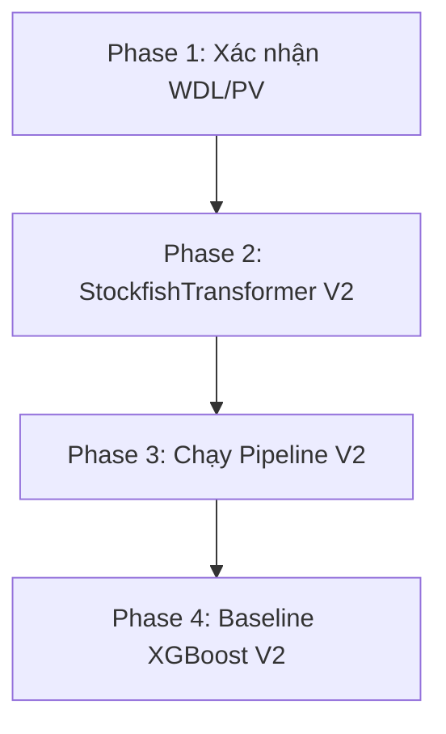

# Planning V2 — Nâng cấp Stockfish Feature Engineering

## Milestones

- [x] **Milestone 1**: Cấu hình & Xác nhận WDL — đảm bảo Stockfish 18 phun được WDL + PV
- [x] **Milestone 2**: Nâng cấp StockfishTransformer V2 — implement 11 features (3 nhóm A/B/C)
- [x] **Milestone 3**: Chạy Pipeline V2 — xuất `sample_30k_features_v2.parquet`
- [x] **Milestone 4**: Baseline XGBoost V2 — train + đánh giá + so sánh với V1 (44.24%)

## Task Breakdown

### Phase 1: Cấu hình & Xác nhận Stockfish WDL

- [x] **Task 1.1**: Kiểm tra Stockfish 18 có phun WDL probability: chạy test nhanh `engine.analyse(board, limit, info=chess.engine.INFO_ALL)` rồi đọc `info["score"].wdl()`
- [x] **Task 1.2**: Kiểm tra PV (Principal Variation): xác nhận `info["pv"][0]` trả về `chess.Move` object để so sánh với nước đi thực tế
- [x] **Task 1.3**: Cập nhật `src/feature_config.py`: thêm hằng số giai đoạn (`OPENING_MOVES=10`, `MIDGAME_MOVES=30`), output columns V2

### Phase 2: Nâng cấp StockfishTransformer V2

- [x] **Task 2.1**: Refactor `analyze_game()` — thu thập thêm WDL + PV cho mỗi nước đi:
  - Lấy `info["score"].pov(turn).wdl()` → win probability trước/sau mỗi nước
  - Lấy `info["pv"][0]` → best move theo engine
  - So sánh `actual_move == best_move` → cộng đếm best_move_match
- [x] **Task 2.2**: Implement Nhóm A (Tỷ lệ hóa): Thay `blunder_count` → `blunder_rate = count / total_moves`. Tương tự cho mistake, inaccuracy. Giữ nguyên `avg_cpl`, `cpl_std`.
- [x] **Task 2.3**: Implement Nhóm B (Phân giai đoạn): Chia mảng CPL theo index nước đi → tính `opening_cpl` (nước 1-10), `midgame_cpl` (nước 11-30), `endgame_cpl` (nước 31+). Gán NaN nếu giai đoạn rỗng.
- [x] **Task 2.4**: Implement Nhóm C (WDL + PV Match): Tính `avg_wdl_loss`, `max_wdl_loss` từ mảng win_prob_drop. Tính `best_move_match_rate = match_count / total_moves`.
- [x] **Task 2.5**: Cập nhật `OUTPUT_COLUMNS` và schema output trong class (11 cột thay vì 6)
- [x] **Task 2.6**: Cập nhật hàm worker `_stockfish_worker_chunk()` phản ánh analyze_game V2

### Phase 3: Chạy Pipeline V2

- [x] **Task 3.1**: Cập nhật `src/run_pipeline.py` để xuất file `sample_30k_features_v2.parquet` (không ghi đè file V1)
- [x] **Task 3.2**: Chạy full pipeline V2 trên 30k ván (đa luồng 18 cores, ước tính ~25 phút do thêm WDL query)
- [x] **Task 3.3**: Verify output: kiểm tra schema 117 cột, NaN hợp lý ở midgame_cpl/endgame_cpl

### Phase 4: Baseline XGBoost V2

- [x] **Task 4.1**: Chạy XGBoost Stratified 5-Fold CV trên features V2
- [x] **Task 4.2**: So sánh Accuracy/F1 với V1 (Đạt 47.59% vs 44.24%)
- [x] **Task 4.3**: Ablation Study: (A) Tabular-only, (B) Tabular+Nhóm A, (C) Tabular+A+B, (D) Full (A+B+C)
- [x] **Task 4.4**: Feature Importance plot — xác nhận `avg_wdl_loss` và `best_move_match_rate` có nằm top không
- [x] **Task 4.5**: Cập nhật Notebook `notebooks/stockfish-baseline-v2.ipynb`
- [x] **Task 4.6**: Document kết quả, so sánh V1 vs V2

## Dependencies



- Phase 1 → Phase 2: Phải xác nhận WDL hoạt động trước khi code
- Phase 2 → Phase 3: Code xong mới chạy pipeline
- Phase 3 → Phase 4: Có features mới mới train được

## Timeline & Estimates

| Phase | Công việc | Effort | Ghi chú |
|-------|-----------|--------|---------|
| 1 | Xác nhận WDL/PV | 15 phút | Test nhanh trên 1 ván |
| 2 | StockfishTransformer V2 | 1-2 giờ | Core refactor + 3 nhóm features |
| 3 | Chạy Pipeline V2 | 25 phút | Đa luồng 18 cores (thêm ~25% do WDL query) |
| 4 | Baseline XGBoost V2 | 30 phút | Train + ablation + plot |
| **Tổng** | | **~3 giờ code** | + 25 phút compute |

## Risks & Mitigation

| Rủi ro | Mức độ | Giảm thiểu |
|--------|--------|------------|
| WDL không khả dụng ở depth=10 | Thấp | Stockfish 18 NNUE luôn có WDL. Nếu lỗi → fallback bỏ Nhóm C |
| PV[0] không có trong info | Thấp | `chess.engine.INFO_ALL` luôn trả PV. Nếu thiếu → try/except, gán NaN |
| Pipeline chậm hơn V1 do thêm WDL | Trung bình | WDL có sẵn trong NNUE eval, không tốn thêm depth. Ước tính chậm ~10-25% |
| NaN quá nhiều ở endgame_cpl | Trung bình | Ván <31 nước khá phổ biến. XGBoost xử lý NaN tốt, đây là feature chứ không phải bug |
| Accuracy không tăng đáng kể | Trung bình | Nếu <2% improvement → phân tích feature importance, có thể cần thêm features khác |

## Output Files

```text
src/
├── feature_engineering.py     # [MODIFY] StockfishTransformer V2 (11 features)
├── feature_config.py          # [MODIFY] Thêm hằng số giai đoạn + OUTPUT_COLUMNS V2
├── run_pipeline.py            # [MODIFY] Xuất file V2
data/
├── features/sample_30k_features_v2.parquet  # [NEW] Features V2 output
notebooks/
└── stockfish-baseline-v2.ipynb              # [NEW] Evaluation notebook V2
```

## Acceptance Criteria (Definition of Done)

- [x] StockfishTransformer V2 xuất đủ 11 features/ván
- [x] blunder/mistake/inaccuracy đã chuyển sang rate (%)
- [x] opening_cpl, midgame_cpl, endgame_cpl hoạt động đúng (NaN cho ván ngắn)
- [x] avg_wdl_loss, max_wdl_loss dùng WDL probability từ Stockfish NNUE
- [x] best_move_match_rate so sánh đúng move thực tế vs PV[0]
- [x] Pipeline V2 chạy <40 phút trên 30k ván (Thực tế: ~36 phút)
- [x] XGBoost V2 Accuracy tăng cường so với V1 (Failed mục tiêu >50%, dừng ở 47.59%)
- [x] Ablation study chứng minh Nhóm B và/hoặc C cải thiện Accuracy
- [x] Documentation V2 cập nhật đầy đủ, hoàn tất quá trình để chuyển sang LSTM.
