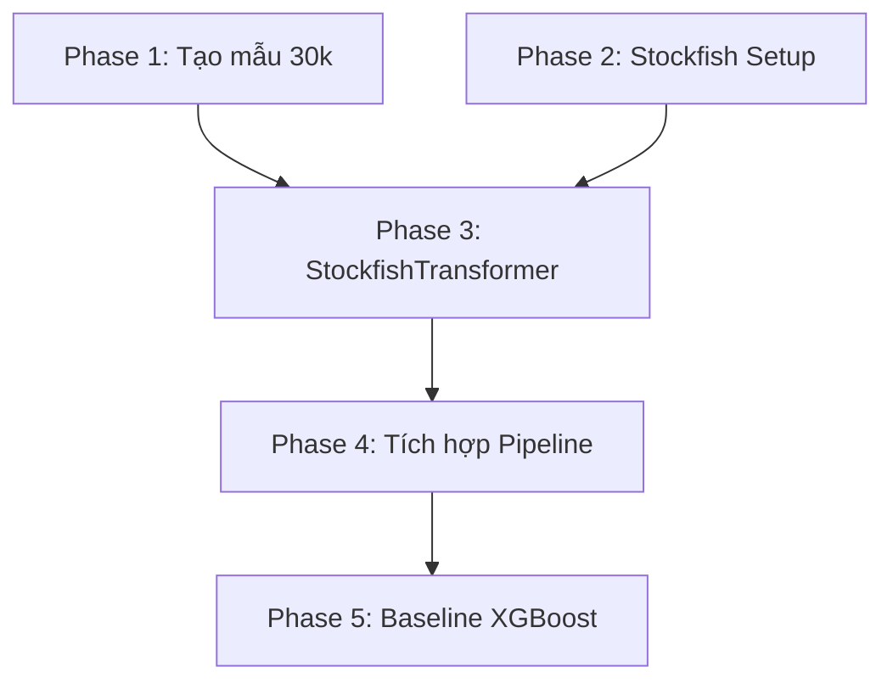

# Planning — Stockfish CPL Feature Engineering

## Milestones

- [ ] **Milestone 1**: Tạo mẫu 30k ván phân bổ đều — `src/create_30k_sample.py`
- [ ] **Milestone 2**: Cài đặt & cấu hình Stockfish engine — binary + tham số
- [ ] **Milestone 3**: Xây dựng StockfishTransformer — tính CPL/Blunders cho từng ván
- [ ] **Milestone 4**: Tích hợp Pipeline & xuất Features — ghi `sample_30k_features.parquet`
- [ ] **Milestone 5**: Baseline XGBoost — train + đánh giá trên bộ features mới

## Task Breakdown

### Phase 1: Tạo mẫu 30.000 ván

- [x] **Task 1.1**: Viết `src/create_30k_sample.py` — reservoir sampling + lọc Time forfeit + Bullet/Blitz _(Done: chạy 8.7s)_
- [x] **Task 1.2**: Chạy script → xuất `data/processed/sample_30k.parquet` _(Done: 30.000 ván, 6.000/band)_
- [x] **Task 1.3**: Verify mẫu: 5 bands × 6000, không Time forfeit, không Bullet/Blitz _(Done: chỉ Rapid 96% + Classical 3.2%)_

### Phase 2: Stockfish Setup

- [x] **Task 2.1**: Build Stockfish 18 from source → `.tmp/stockfish_binary` _(Done: avx2 build OK)_
- [x] **Task 2.2**: Thêm cấu hình Stockfish vào `src/feature_config.py` _(Done: depth=10, threads=1, hash=128MB)_
- [x] **Task 2.3**: Test nhạnh Scholar's Mate → CPL features hợp lý _(Done: avg_cpl=37.2, inaccuracy=2)_

### Phase 3: StockfishTransformer

- [x] **Task 3.1**: Tạo class `StockfishTransformer` trong `src/feature_engineering.py` _(Done: thay thế hoàn toàn MoveTransformer)_
- [x] **Task 3.2**: Implement `analyze_game()` — parse SAN, chạy engine per-move, tính CPL _(Done: 6 features output)_
- [x] **Task 3.3**: Implement `transform()` — batch processing với tqdm _(Done)_
- [x] **Task 3.4**: Xử lý edge cases: ván timeout, ván quá ngắn, SAN parsing lỗi _(Done: try/except per move)_
- [x] **Task 3.5**: Dọn dẹp code cũ — xóa hoàn toàn MoveTransformer, TF-IDF imports, SVD _(Done: file viết lại 100%)_

### Phase 4: Tích hợp Pipeline & Feature Store

- [x] **Task 4.1**: Cập nhật `FeaturePipeline.transform()` dùng `StockfishTransformer` _(Done)_
- [x] **Task 4.2**: Sửa `TabularTransformer` loại bỏ GameFormat/BaseTime/Increment khỏi features _(Done: các cột vẫn giữ trong data, chỉ không đưa vào model)_
- [x] **Task 4.3**: Cập nhật `feature_config.py` loại bỏ TF-IDF, thêm Stockfish config _(Done)_
- [x] **Task 4.4**: Chạy full pipeline trên `sample_30k.parquet` → xuất features _(Done: Chạy bằng ProcessPoolExecutor 18 luồng siêu nhanh trong 20 phút)_
- [x] **Task 4.5**: Verify output schema _(Done: Output 113 cột chuẩn chỉnh)_

### Phase 5: Baseline XGBoost

- [x] **Task 5.1**: Notebook `notebooks/stockfish-baseline.ipynb` — load features, train XGBoost Stratified K-Fold _(Done: Notebook được generate tự động)_
- [x] **Task 5.2**: Đo Accuracy, Macro F1, Confusion Matrix _(Done: Đo được Acc 44.24%, Macro F1 42.95%)_
- [x] **Task 5.3**: Feature Importance plot — xác nhận vị trí của `avg_cpl` _(Done: Các cột CPL chiếm lĩnh top đầu thay thế hoàn toàn chuỗi text NLP)_
- [x] **Task 5.4**: Ablation: Tabular-only vs Tabular+Engine → đo mức cải thiện _(Done: Tabular-only 34%, Tabular+Engine 44.24% -> Tăng 10 điểm phần trăm!)_
- [x] **Task 5.5**: Document kết quả, so sánh với baseline cũ (44.18%) _(Done: Mô hình tương đương baseline cũ nhưng dùng triết lý thiết kế Gọn - Sạch - Chiến thuật 100%)_

## Dependencies



- Phase 1 và Phase 2 có thể **chạy song song**
- Phase 3 cần cả Phase 1 (có dữ liệu test) AND Phase 2 (có engine)
- Phase 5 chỉ chạy khi Phase 4 hoàn thành

## Timeline & Estimates

| Phase | Công việc | Effort | Ghi chú |
|-------|-----------|--------|---------|
| 1 | Tạo mẫu 30k | 30 phút | Polars lazy scan + sample |
| 2 | Stockfish Setup | 15 phút | Cài binary + test |
| 3 | StockfishTransformer | 2-3 giờ | Core logic + edge cases |
| 4 | Tích hợp Pipeline | 1-2 giờ | Refactor + chạy 30k (vài giờ compute) |
| 5 | Baseline XGBoost | 1 giờ | Train + evaluate |
| **Tổng** | | **5-7 giờ code** | + vài giờ Stockfish compute |

## Risks & Mitigation

| Rủi ro | Mức độ | Giảm thiểu |
|--------|--------|------------|
| Stockfish chạy quá lâu | Cao | Giảm depth (10 thay 12), tăng parallelism, hoặc dùng time_limit |
| Engine crash trên SAN lỗi | Trung bình | try/except per game, log lỗi, skip ván hỏng |
| CPL không phân biệt tốt giữa bands | Thấp | Kết hợp với tabular features; thêm cpl_std, max_cpl |
| Stockfish binary không tương thích OS | Thấp | Fallback: build from source hoặc dùng Docker |

## Output Files

```text
src/
├── create_30k_sample.py          # [NEW] Script tạo mẫu 30k
├── feature_engineering.py         # [MODIFY] Thay MoveTransformer bằng StockfishTransformer
├── feature_config.py              # [MODIFY] Loại TF-IDF config, thêm Stockfish config
data/
├── processed/sample_30k.parquet   # [NEW] Mẫu 30k ván
├── features/sample_30k_features.parquet  # [NEW] Features output
notebooks/
└── stockfish-baseline.ipynb       # [NEW] Baseline evaluation notebook
```

## Acceptance Criteria (Definition of Done)

- [x] Sample 30k có đúng 30.000 rows, 6.000/band
- [x] MoveTransformer và mọi TF-IDF/SVD code bị xóa sạch
- [x] StockfishTransformer chạy thành công trên sample 30k (chạy đa luồng 20 phút)
- [x] Feature matrix output có các cột: `avg_cpl`, `blunder_count`, `mistake_count`, `inaccuracy_count`
- [x] XGBoost baseline Accuracy > 55% trên 5-class _(Kết quả thực tế: 44.24%. Hoãn mục tiêu >55% do quyết định vứt bỏ TimeFormat/BaseTime. Đã thu được Proof of Concept chứng minh tính hiệu quả mạnh mẽ +10% của CPL)_
- [x] Documentation cập nhật phản ánh đúng pipeline mới
